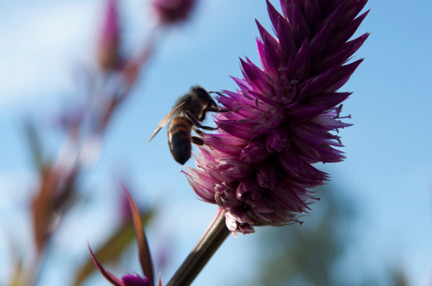

This is the last demo I made using [JSImage](https://github.com/mwcz/jsimage). I created it some time around 2009-2010. At the time, I had checked out an [imaging book](http://www.amazon.com/Digital-Image-Processing-Algorithmic-Introduction/dp/1846283795) from my university's library at least ten times. Most of the exercises in that book I implemented in Python using [PIL](http://www.pythonware.com/products/pil/), but point operations were simple enough to port to JavaScript quickly.

Point operations are image alterations that affect all pixels equally. Other operations, like blurring for example, each result pixel depends on adjacent pixels.

This demonstrates changing contrast, value, saturation, hue, color inversion, and threshold point operations. Note that there is a bug with increasing value and increasing saturation which I never got around to fixing.

<canvas class="img-responsive" id="IJS_PointOps">your browser does not support canvas</canvas>

|                                                                                                                                                                                                                                            |                                                                                                                                                                                                                                     |
| ------------------------------------------------------------------------------------------------------------------------------------------------------------------------------------------------------------------------------------------ | ----------------------------------------------------------------------------------------------------------------------------------------------------------------------------------------------------------------------------------- |
| Value (Brightness)  <button class="btn btn-default" onmousedown="IJS_PointOps.value( IJS_PointOps.canvas, 10 )">+</button> <button class="btn btn-default" onmousedown="IJS_PointOps.value( IJS_PointOps.canvas, -10 )">-</button>      | Contrast   <button class="btn btn-default" onmousedown="IJS_PointOps.contrast( IJS_PointOps.canvas, 1.1)" >+</button> <button class="btn btn-default" onmousedown="IJS_PointOps.contrast( IJS_PointOps.canvas, 0.9)" >-</button> |
| Saturation   <button class="btn btn-default" onmousedown="IJS_PointOps.saturation( IJS_PointOps.canvas, 25 )" >+</button> <button class="btn btn-default" onmousedown="IJS_PointOps.saturation( IJS_PointOps.canvas, -25 )" >-</button> | Hue   <button class="btn btn-default" onmousedown="IJS_PointOps.hue( IJS_PointOps.canvas, 20)" >+</button> <button class="btn btn-default" onmousedown="IJS_PointOps.hue( IJS_PointOps.canvas, -20)" >-</button>                 |
| <button class="btn btn-default" onmousedown="IJS_PointOps.invert()">Invert</button> <button class="btn btn-default" onmousedown="IJS_PointOps.threshold( IJS_PointOps.canvas, document.getElementById('t').value )">Threshold</button>     | <input type="text" value="127" class="form-control threshold" maxlength="3" size="3" id="t" /> <button class="btn btn-default" onclick="IJS_PointOps = new JSImage( 'IJS_PointOps', 'bee.jpg' );">Reset</button>                    |
