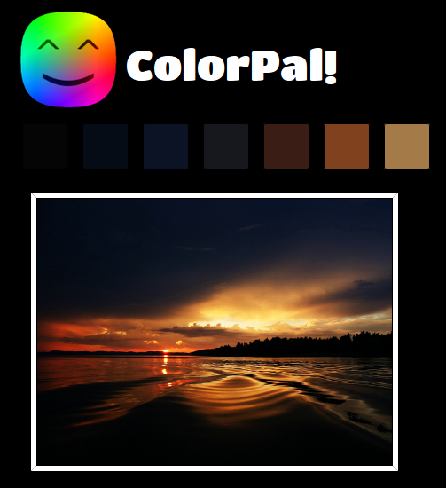
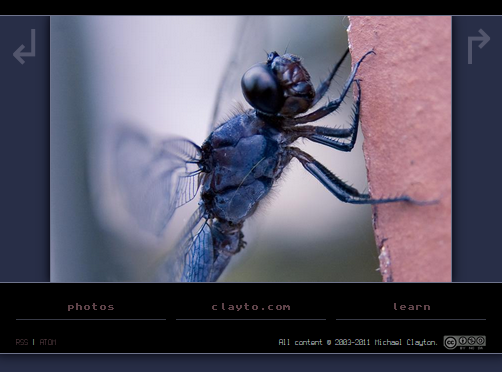

Introducing ColorPal!

I've been toying with color palette generation for years. My photography website has always had some form of dynamic palette, so the theme of each page matches the photo. You can see the current iteration [here](http://clayto.com/photos):

<figure></figure>

I owe the idea of photo-matching website palettes to [Noah Grey](http://noahgrey.com). Each iteration of my photo site has gotten a slightly more advanced palette generation tool. You can see murmurs of them in the [old](/2011/11/16/html5-canvas-eyedropper/) [canvas](/2011/11/16/html5-canvas-area-selection-averaging/) [demos](/2011/11/17/html5-tool-for-creating-color-palettes-from-an-image/) I've posted. Sooner or later I'll make a more thorough post about the tools I've created for each iteration of the site. Anyway, back to ColorPal.

ColorPal is an HTML5 palette generation tool. Currently it's in a very early stage, and I've only tested it in Chrome. I have many ideas for improvements, and I'd love to hear anyone's ideas as well.

<figure>
    
</figure>

It's powered by [canvas](http://en.wikipedia.org/wiki/Canvas_element), [data URIs](https://developer.mozilla.org/en/data_URIs), [File API](http://dev.w3.org/2006/webapi/FileAPI/), and my homespun [median-cut](http://en.wikipedia.org/wiki/Median_cut) implementation, which I'm calling _median-cut.js_.

Bear in mind that while I've kept median-cut.js nice and clean, I did hammer out ColorPal as quickly as possible, so it's a mess. Why? I expect median-cut.js to be useful to other programmers, but ColorPal is just a tool for designers. Or it will be, anyway. :)

Here are github repos for [ColorPal](https://github.com/mwcz/ColorPal) and [median-cut.js](https://github.com/mwcz/median-cut-js).

And, as a reward for reading to the end, a [live demo](/projects/colorpal/)!
