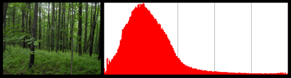
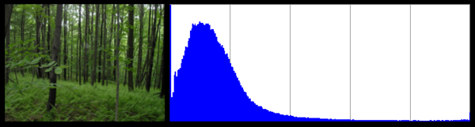

In my [last post](/2012/01/16/colorpal-alpha/) on the subject, I introduced
ColorPal, my HTML5 color palette generation tool. It didn't perform well with
certain types of images, so I fixed it. :)

---

Color palettes will now match the image even better. Especially for images
with infrequent but _important_ colors. Here's a comparison of the old and new
methods, on an image that is mostly black:

You can see that with the old method, the black pixels definitely took over the
palette.

[Try it with your own images!](/projects/colorpal)

For some images, this change won't affect palettes at all. But for images with
low-population, high-importance colors, like the one above, palettes will look
_much_ better!

Technical discussion below.

# Why the 'median' in median-cut?

Median Cut is an algorithm typically used to reduce the number of colors in an
image.

The steps to perform median cut are fairly straightforward:

1.  Find the smallest box which contains all the colors.
2.  Sort the enclosed colors along the longest axis of the box.
3.  Split the box into two regions at median of the sorted list.
4.  Repeat the above process until the original color space has been divided into N regions where N is the number of colors you want.

Not too bad, right? The question remains, though, why median?

Mean, median, and mode all attempt to measure the
[location](http://en.wikipedia.org/wiki/Location_parameter) of a probability
distribution. Worded more intuitively... they try to find the center of a set
of numbers. They just employ different definitions of "center".

(Thanks [Wikipedia](http://en.wikipedia.org/wiki/Median))

As you can see clearly in the dashed data set, the mean tends to follow the
tail. In other words, mean is useful when outliers are important. When
generating a color palette, outliers are essential. Outliers may be the small
streak of color in an otherwise drab sky, or a small red rose in the middle of
a green field.

The goal of median cut is _not_ to generate a color palette. It's to
efficiently reduce the number of colors in an image. Since my goal with
ColorPal is to find good-lookin' colors, I've modified the algorithm to split
boxes at the **mean** instead of the **median**. Mean splits boxes closer to
the outliers, which keeps low-population colors nicely segregated from the
high-population colors.

Thus step 3 becomes:

- Split the box into two regions at the <b>mean</b> of the sorted list.

The result? Mean Cut! Also: awesome color palettes.

## Interesting side-note on color distributions

Interestingly, photographs of nature tend to have nice, close-to-normal color
distributions. A "normal distribution" is a formal term for a "bell curve".

Check out the red, green, and blue distributions for a photograph of a forest.

For comparison, here are the distributions for a shot of NYC.

## What's next for ColorPal? Color spaces.

Mean-cut improves ColorPal dramatically for some images, but it's still not
perfect. Perfection probably won't be attainable, but there are still many
ways to improve.

My next test will be converting to a color space other than RGB.

HSL is common, and the RGB/HSL conversion formulas are in my very old JSImage
project. It may not turn out well, though, as the concept of "widest box"
loses most of its meaning when each axis is a completely different unit of
measure. Although, in a way, I suppose RGB has a similar problem. Red, Green,
and Blue could be thought of as unrelated units. I'll try it out and see how
it goes. I wonder if my old JavaScript RGB/HSL code has rotted away yet...

Most likely, I'll skip HSL and try one of the
[Lab](http://en.wikipedia.org/wiki/Lab_color_space) color spaces first, since
they are not composed linear values like RGB and HSL. Instead, Lab color
spaces use non-linear scales that closely match human perception of color.
Perfect for my purposes. How fortuitious for me that CIE invented it way back
in 1931.

There are three "Lab" color spaces: XYZ, Hunter-Lab,
and CIELAB. XYZ will be first to the plate, since the RGB/XYZ formulas are
the simplest. Let me take this opportune moment to plug
[EasyRGB.com](http://www.easyrgb.com/index.php?X=MATH).

## Lend a hand

As I've mentioned before, ColorPal is in an early stage of development. It
needs testing in multiple browsers, and I'm very interested in hearing people's
feedback. Code development help is welcomed too.

If you try out ColorPal, let me know your thoughts on
[Twitter](https://twitter.com/mwcz).

Here are github repos for [ColorPal](https://github.com/mwcz/ColorPal) and
[median-cut.js](https://github.com/mwcz/median-cut-js).
