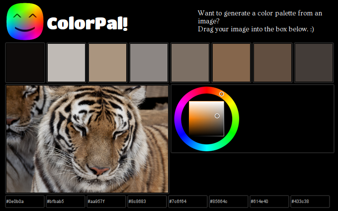

Hi pals.

This is a speedy post about a speedy update I made today to
[ColorPal](/projects/colorpal/), an HTML5 tool I wrote that automatically
generates color palettes from a photograph.

Previously, ColorPal provided hex codes for each color extracted from the
image. Eight individual &lt;input&gt;s at the bottom of the page displayed the
colors.

I use ColorPal a lot (my own dogfood and all that) when designing websites, and
it wasn't long before I got fed up (hah!) with copying values from eight
freaking inputs.

Blah:

Huzzah:

All eight colors can be pasted out in one fell swoop of the mouse.

[ColorPal Demo](/projects/colorpal/)

Works in Chrome and Firefox.

**Pro tip**: you can edit the values in the textarea and the palette will be
instantly updated to reflect your edits. This means you can also paste in
a list of colors (hex format only for the time being).

If you try out ColorPal, let me know your thoughts on
[Twitter](https://twitter.com/mwcz).

Here are github repos for [ColorPal](https://github.com/mwcz/ColorPal) and
[median-cut.js](https://github.com/mwcz/median-cut-js).

This minor update is part of the groundwork for some exciting changes to my
sorely neglected [photography site](http://clayto.com/). I still post photos
regularly, but haven't given it any fresh coding love for about two years. See
how the colorscheme of each page matches the photograph? That's done with an
older palette generation implementation (which I should write about someday),
but pretty soon it'll be ColorPal pumping out those swatches.

That's not the only change. If you're not excited, don't worry. I am!

Happy coloring!
