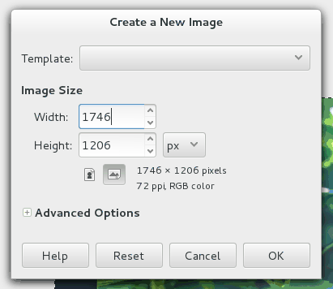

Ever been here?

 > I want to double the size of this image
 >
 > open calculator
 >
 > type in current width * 2
 >
 > type in current height * 2
 >
 > paste results back into the Create New Image dialog

I've done that countless times.  As I was about to do the same thing once more,
I thought "Hmm, wouldn't it be nice if we could do simple math inside the New
Image dialog?  Well, I tried it and it worked.

The feature was added in GIMP 2.8, so it's fairly recent.

 > Enhancements have also been made to the size entry widget, which is used for
 > inputting most of the x, y, width, height parameters. For example, in the
 > scale dialog it is now possible to write “50%” in the Width field to scale
 > the image to 50% of the width. Expressions such as “30in + 40px” and “4 *
 > 5.4in” work, too.

From the [GIMP User Manual][1].

[1]: http://docs.gimp.org/2.8/en/gimp-introduction-whats-new.html "GIMP User Manual"
