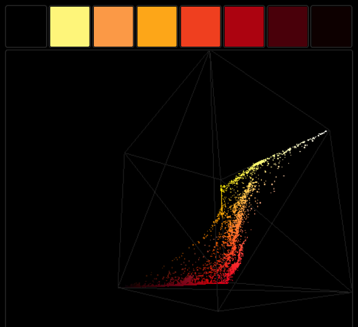

I spent a bit of time this weekend building an RGB color cube for
[ColorPal][4], using [Three.js][1]. Drag and drop any image, and you'll see a
cube with all the pixels of your image mapped into 3D space.

<a class="btn btn-default btn-lg"
href="/static/projects/colorpal_colorcube">Launch live demo!</a> and [view the
code][5].

Your web browser must support WebGL, which at this point in history means a
fairly recent Firefox or Chrome. In case your web browser doesn't support
WebGL, here's a video to enjoy while you download [Firefox Nightly][ffn]. ;)



[Three.js][1] has proven to be pretty fun. The documentation is decent, but
not comprehensive. Some parts of the API are filled with "todo" notes instead
of actual documentation.

Luckily, the omissions in the documentation are made up for by the extensive
[set of code examples][2]. Any time I couldn't get what I needed from the API
docs, I skimmed the examples until I found an existing scene that had the
effect I needed.

For this demo, drawing a cube was easy, and even populating it with dots was easy, but

## Colored particles

The color cube uses a particle system to render 2D color points inside a 3D
cube.

Eventually I found a [particle system demo with colors][3], which held the key.

By setting `vertexColors: true` on the `ParticleSystemMaterial`, Three.js will
match each vertex in the `vertices` array with a color in the `colors` array.
`vertices[1726]` will use `colors[1726]`, for example.

A vertex and a color are created for each pixel in the source image. For the
vertex, red values are mapped to the `X` axis,
and similarly green to `Y` and blue to `Z`.

## Optimization

Rendering a point for each pixel in a huge image image would be overkill, so
I used the pixel culling already present in ColorPal to scale the number of
points down to a more reasonable 1282. Increasing that number also
increases the quality of the cube. If you look closely in the video above, the
ColorPal logo cube has gaps in it. The better the quality, the longer the
startup time, though.

Now I'm racking my brain for an excuse to use WebGL at Red Hat...

Any ideas?

[1]: http://threejs.org
[2]: http://threejs.org/examples/
[3]: http://threejs.org/examples/#webgl_particles_billboards_colors
[4]: http://colorpal.org
[5]: https://github.com/mwcz/mwcz/blob/master/content/static/projects/colorpal_colorcube/js/cp-colorcube.js
[ffn]: https://nightly.mozilla.org/
