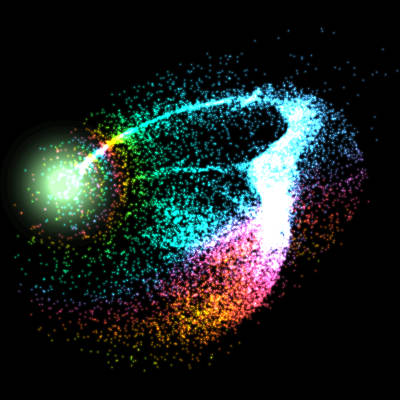
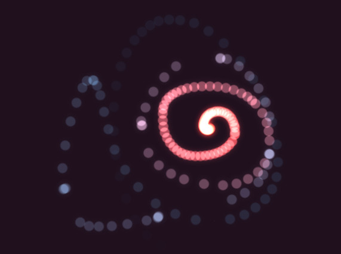
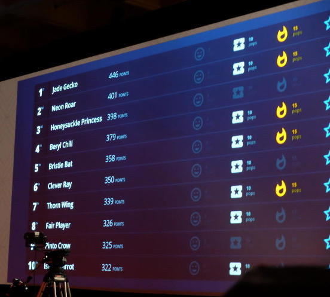
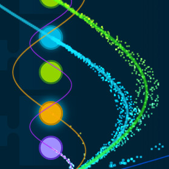

"_Finally,_" I thought, "_an excuse to play with WebGL at work!_"

This year, I had the good fortune of contributing to a keynote presentation at
[Red Hat Summit][summit]. During the keynote, an audience of 5,000 played a
mobile web game created by our team. The game was backed by several
[microservices][microservices] which we modified on stage while the audience
played.

My contribution was to display, in a visual and engaging way, the live network
traffic flowing through our system.

Being a web guy, I wanted to accomplish this on a webpage, but with such a
large audience, the number of network requests would rocket past what could be
efficiently rendered with HTML and CSS.

---

### Tiny Particles of Sand

While developing [DiMo][dimo-particles] and [Kimotion][kimotion-web], I became
fond of [three.js][threejs] particle systems for their performance and visual
charm.

    <figure>
        
        <figcaption>Particle gravity simulation in <a href="/projects/dimo">DiMo: Particles</a> (50,000 particles)</figcaption>
    </figure>
    <figure>
        
        <figcaption>Rendering a Kinect depth field with 480,000 particles in <a href="/projects/kimotion">Kimotion</a></figcaption>
    </figure>

WebGL particle systems can handle many thousands of particles without breaking
a sweat. It can even handle _drawing_ millions of particles, although _moving_
that many particles is often CPU-bottlenecked. Fancy [tricks][gpgpu] can beat
that limitation, although such tricks are still tedious in WebGL.

Alright, let's make some particles.

---

### It's Pixel Time

When a network request is detected, the particle system moves a tiny dot in an
arc to its destination.

    <figure>
        <video style="margin: 0 auto" poster="traffic-viz-basic-thumb.jpg" autoplay controls loop>
            <source src="traffic-viz-basic.mp4" />
            <source src="traffic-viz-basic.webm" />
        </video>
        <figcaption>Particles arc from purple to blue</figcaption>
    </figure>
    <figure>
        <video style="margin: 0 auto" poster="traffic-viz-bluegreen-thumb.jpg" autoplay controls loop>
            <source src="traffic-viz-bluegreen.mp4" />
            <source src="traffic-viz-bluegreen.webm" />
        </video>
        <figcaption>Particles alternate between blue and green</figcaption>
    </figure>

The arcs are defined by sine waves. Here are the particle arcs as they appear
on-screen, and another shot with sine wave guides showing.

    <figure>
        
        <figcaption>Particle arcs</figcaption>
    </figure>
    <figure>
        
        <figcaption>Sine wave guides</figcaption>
    </figure>

To prevent the arcs from overlapping with each other too much, I increased each
wave's amplitude based on vertical distance to be traveled. In essence,
amplitude increases linearly with wavelength. That's why the green arc is
bigger than the blue arc, etc.

Initially, the particles traveled in single-file, which obscured the quantity
of particles. To remedy that, I added a small random horizontal offset unique
to each particle. The offset diminishes at the ends of the arc, which causes
the particles to fan out near the middle.

The particles that enter from the right side of the screen represent network
traffic from the audience. As you can see in the video below, the origin point
of those particles moves randomly up and down to add more visual interest.

---

### Together at Last

After months of collaborating from across the world, it was wonderful to meet
the whole team in person. A few days later, all our hard work came together as
well. All the preparation paid off and the demo worked perfectly. Here's a
shot of my particle visualization from the official recording.

<figure>
    <video style="margin: 0 auto" poster="traffic-thumb.jpg" autoplay controls loop>
        <source src="traffic.webm" />
        <source src="traffic.mp4" />
    </video>
</figure>

Watch the full keynote here:



---

### Glow Rope

Early on, before traffic data was available, I had the particles follow the
mouse instead. It was pretty fun, so I spun it off into a simple demo called
[Glow Rope][glow-rope]. Give it a try (mouse required)!

<figure>
    
    <figcaption>
<a class="btn btn-default btn-lg" href="/demos/glow-rope">Play Glow Rope</a>
</figcaption>
</figure>

---

### Leaderboard

In addition to the network traffic visualization, I helped build a leaderboard
view to display the scores and achievements of the top 10 players in the
audience. [Andres][andres] created the beautiful design and handed me a static
mockup which I converted into a dynamic template using [Ractive][ractive]. I
then created a WebSocket connection to the _score microservice_ to populate the
data. Here's a shot of the winners from the live audience.

---

### Next Year

The amount of work and preparation that goes into a presentation like this was
eye-opening for me. A week out and tired to the bone, I was thinking "No way
am I doing this next year!" But the thrill of everyone's hard work coming
together drove away the exhaustion. I can't wait to see what we can cook up
next year.

[andres]: https://twitter.com/andresgalante/
[dimo-particles]: /projects/dimo
[glow-rope]: /demos/glow-rope
[kimotion-web]: http://kimotion.xyz
[ractive]: http://ractivejs.org/
[summit]: https://www.redhat.com/summit
[threejs]: http://threejs.org
[video]: https://www.youtube.com/watch?v=ooA6FmTL4Dk
[gpgpu]: https://en.wikipedia.org/wiki/General-purpose_computing_on_graphics_processing_units
[microservices]: https://en.wikipedia.org/wiki/Microservices
