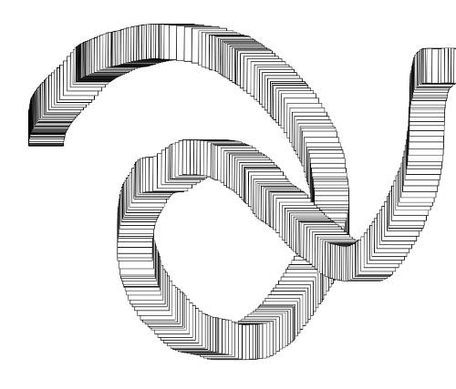
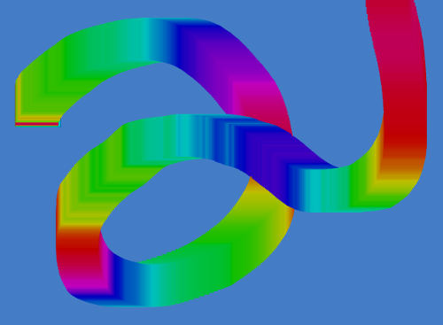

Kimotion is a simple framework for creating interactive art exhibits in 2D or
3D and supports both [Kinect][kinect] and [Leap Motion][leap] for viewer input.
This tutorial will focus on the Leap, so to proceed with the tutorial you'll
need to [set up your Leap][leap-setup].

Once the leap service is running, you can set up Kimotion!

## Get the code

    git clone git@github.com:mwcz/Kimotion.git
    cd Kimotion

If you don't know how to use `git`, no problem, just download and extract the
[Kimotion zip file](https://github.com/mwcz/Kimotion/archive/master.zip)
instead.

## Boot it up

Start a simple web server:

    ./start.sh

Then open [localhost:8000/#example2d](http://localhost:8000/#example2d).

Wave your hand around and you should see a trail of black-outlined squares,
like this:



## Create your mod!

The easiest way to start your own mod is to make a copy of the default mod.
Come up with a name for the mod, let's say `mymod`:

    cd src
    cp -r mods/example2d mods/mymod

Open `index.html`, find where it says `<!-- Kimotion mods-->`, and right after
it add a script tag to include your mod.

```html
<script src="mods/mymod/main.js"></script>
```

Open `mods/mymod/main.js` and on the very first line, change `class example2d`
to `class mymod`.

Open `mods.js` and add your mod name (`mymod`) to the list.

Whew, that process was pretty tedious, sorry about that.

You can now open [localhost:8080/#mymod](http://localhost:8080/#mymod) and see
your mod in action! It's going to look just like the example mod, but now it's
time to make it your own.

## Customize your mod

Open `mods/mymod/main.js` and look at the general layout. There's a
`constructor` function for your initial setup, and an `update` function which
runs once per frame (at 60 frames per second, ideally).

Many of the function calls (like `background` and `fill`) come from [p5][p5],
an **awesome** 2D drawing library. All of p5 is available to you, so take a
look at p5's [function reference][p5-ref] for all the possibilities.

For your first tweak, replace `rect` with `ellipse`, and refresh your browser.
Voila!


There's an existing mod with a few more tweaks, Rainbow Squares. It finds out
the angle of hand motion and colors the square based on that angle.



Check out [Rainbow Squares][rainbow-square] if you're interesting in using an
effect like that.

## Modding resources

At this point, you're an experienced Kimotion modder. If you have an idea but
would like some feedback before getting started, I'm eager to assist. Here are
a few ways to get help:

- Tweet [@mwcz][twitter]
- Open a [Kimotion issue][kimotion-issue]
- Explore the existing [Kimotion mods][mods]

[kimotion-web]: http://kimotion.xyz
[kinect]: http://www.xbox.com/en-US/xbox-360/accessories/kinect
[leap]: https://www.leapmotion.com/
[leap-setup]: https://www.leapmotion.com/setup
[npm]: https://www.npmjs.com/
[p5]: https://p5js.org/
[p5-ref]: https://p5js.org/reference/
[mods]: https://github.com/mwcz/Kimotion/tree/master/src/mods
[mod-ideas]: https://github.com/mwcz/Kimotion/issues?q=is%3Aopen+is%3Aissue+label%3A%22mod+idea%22
[kimotion-issue]: https://github.com/mwcz/Kimotion/issues/new
[twitter]: https://twitter.com/mwcz
[rainbow-square]: https://github.com/mwcz/Kimotion/blob/master/src/mods/rainbow-square/main.js
