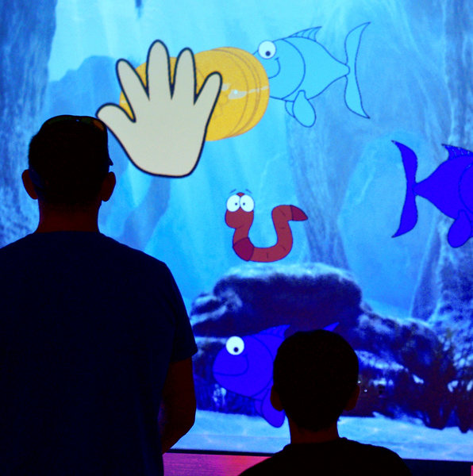

Just a few short <del>days</del> months ago, [Kimotion][kimotion] was on
display at SPARKcon. SPARKcon is a large art festival in Raleigh, and we
occupy a small slice of it called geekSPARK.

## Kimotion Levels Up

Last year's tech had a rudimentary and finicky [hand tracking][ht] system. It
was workable, but a lot of visitors had trouble using it, especially kids.
This year, I added Leap Motion support, which was a huge... _jump_ forward for
hand tracking.

<figure>
<video style="margin: 0 auto" controls autoplay loop>
<source src="arm.mp4" />
<source src="arm.webm" />
</video>
</figure>

Adam, of Maniacal Labs, built the fantastic adjustable Leap Motion mounting arm
shown above. It allowed visitors of any height to participate comfortably and
worked like a dream.

Several new mods were written as well, though Jared's Fish mod remained the
most popular by a large margin!

Another big change was simplifying the mod writing experience for beginners.
By removing the project's build system entirely, the _get started_ instructions
are essentially "unzip file, run `start.sh`". Browser support for [ES6][es6]
has come a long way since last year, so I was able to remove Babel and run raw
ES6 code in Firefox and Chrome. Beginners are no longer put off by the complex
build system. Plus, not having to wait while builds run is a nice bonus.

## Maniacal Labs

We shared the room with Adam and Dan from [Maniacal Labs][ml], who brought
their [awesome][ml1] [LED][ml2] [displays][ml3]. Adam even wrote a brand new
Kimotion client to run on their biggest display, which you can see a clip of in
the video at the top of this post.

Our two exhibits fit so well together that we're considering uniting even
further next year.

<!-- Commenting this out until I find a hugo gallery solution that supports thumbnails.
## Pictures!

$GALLERY
-->

## Viva la geekSPARK!

<figure>
    
</figure>

Thanks to Truett and Noel for all their organization and support. Thanks to
Ian for pulling me into this project two years ago and for climbing into the
ceiling to shut off the lights. And thanks to all the [Kimotion
contributors][kc] for building mods and adding color and fun to everyone's
weekend.

    

[kimotion]: http://kimotion.xyz
[ml]: http://maniacallabs.com/
[ml1]: http://maniacallabs.com/2016/06/28/jumbo1k-32x32-led-networked-display/
[ml2]: http://maniacallabs.com/WyoManiacalDisplay/
[ml3]: http://maniacallabs.com/2015/09/22/building-the-colossus-led-display/
[redhat]: https://www.redhat.com
[kc]: http://kimotion.xyz/#contributors
[es6]: https://en.wikipedia.org/wiki/ECMAScript#6th_Edition_-_ECMAScript_2015
[ht]: https://vimeo.com/136950949
[lm]: https://www.leapmotion.com
