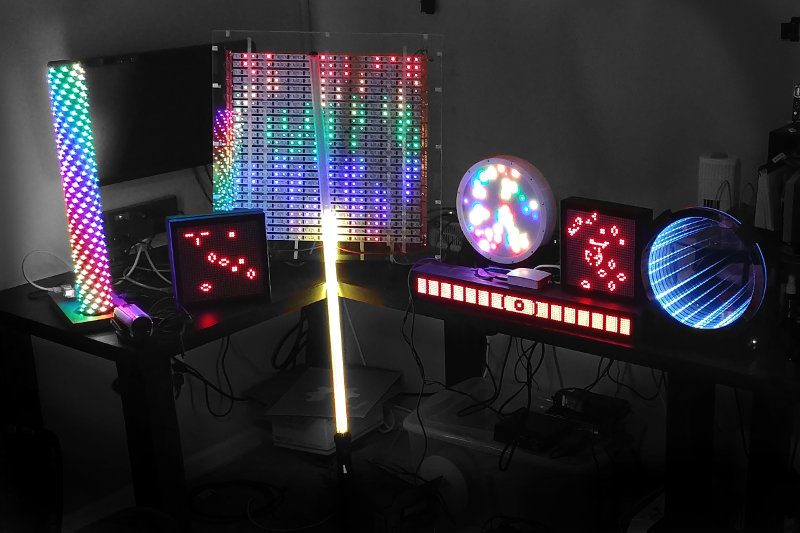
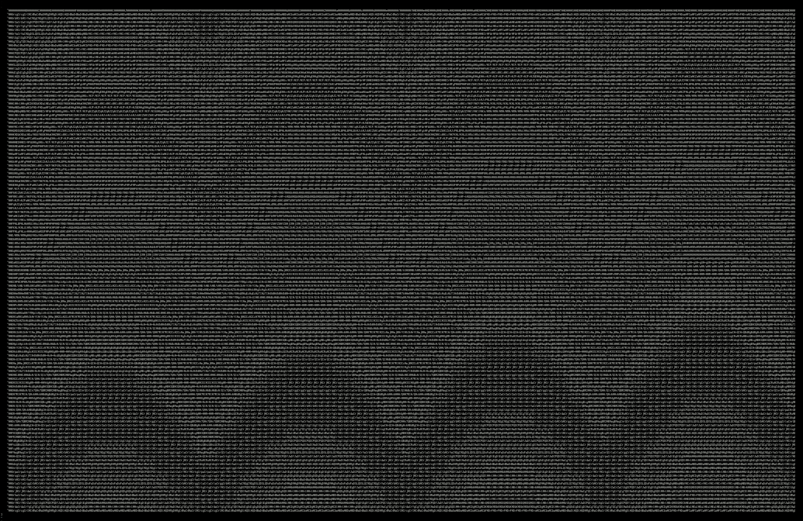

I have someone I'd like you to meet. SimPixel, meet everyone. Everyone,
SimPixel.

# SimPixel, introduce yourself

SimPixel is a WebGL visualizer for LED displays, _very_ much like the ones Adam
and Dan build over at [Maniacal Labs][mlabs].

<figure>

</figure>

Very much alike.  In fact, it's probably _so_ much like their displays because I built
most of SimPixel while sitting at Adam's workbench. I don't know, there could
be a connection. If you too would like to take a seat at Adam's illustrious
workbench someday, [hack away][source]. You can also try the [fullscreen
demo][demo].

[BiblioPixel][biblio], <abbr title="Maniacal Labs">ML's</abbr> light animation
library, sends layouts and colors to SimPixel using a simple [WebSocket][ws]
protocol.

---

# The Protocol

By itself, SimPixel is useless. To turn on the lights, it connects to a
WebSocket service. That service is expected to send certain messages, namely a
configuration message followed by a series of color messages.

---

## Configuration message

The configuration message conveys the spatial layout of the LEDs.

For example, a configuration message of `0x0000009A02FE000C` is interpreted as
follows.

| opcode |    X |    Y |    Z
|--------|------|------|------
| 0x0000 | 009A | 02FE | 000C
| config |  154 |  766 |   12

The leading `0x0000` opcode identifies this as a configuration (ie, setup) message,
followed by a series of 16-bit signed integers which indicate the 3D
coordinates of each LED, of the form: <code>X1,Y1,Z1,X2,Y2,Z2,
..., Xn,Yn,Zn</code>

---

## Color message

The color message(s) specify what color each LED should be at the current
moment in time.

An example color message, `0x0001 40 D6 7F`, breaks down to:

| opcode |   R |   G |   B |
|--------|-----|-----|-----|
| 0x0001 |  40 |  D6 |  7F |
| color  |  64 | 214 | 127 |

The leading `0x0001` opcode identifies this as a color message, followed by a
series of 8-bit unsigned integers which indicate the RGB colors of each LED,
of the form:
<code>R1,G1,B1,R2,G2,B2,
..., Rn,Gn,Bn</code>

For a concise reference, see [PROTOCOL.md][protocol].

---

# The Ghost in the Recording

The live demo at the top of this post isn't connected to any WebSocket service.
Instead, it's using a recording apparatus that I cobbled together. I pushed
a configuration frame and a bunch of color frames into an array, converted
their ArrayBuffers into base64 strings, and saved those into [a quite large
JSON recording file][rec].

I only mention it to lead up to the following. While editing the recording
JSON file, I zoomed out a little and something caught my eye. I zoomed out
more and a pattern took shape.

Here's a screenshot of the JSON file in my terminal, zoomed out as far as it'll
go.

The waves of red, green, and blue is evident even in this doubly-encoded
format. Pretty cool.

<!-- SimPixel embedded -->

<!-- third party -->

<!-- first party -->

    

[mlabs]: http://maniacallabs.com/
[ws]: https://en.wikipedia.org/wiki/WebSocket
[source]: https://github.com/ManiacalLabs/SimPixel
[protocol]: https://github.com/ManiacalLabs/SimPixel/blob/master/PROTOCOL.md
[rec]: https://github.com/ManiacalLabs/SimPixel/blob/recording-draft/src/recordings/vis.json
[biblio]: https://github.com/ManiacalLabs/BiblioPixel/wiki
[demo]: /static/projects/simpixel
