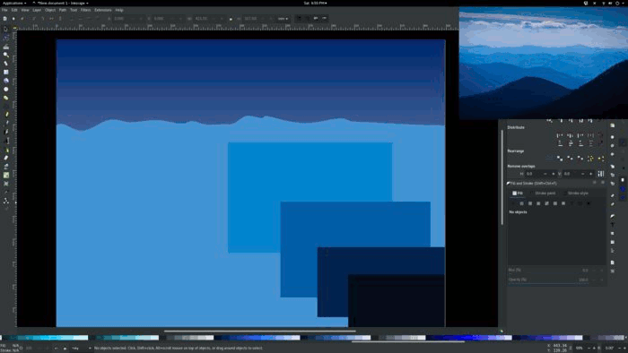
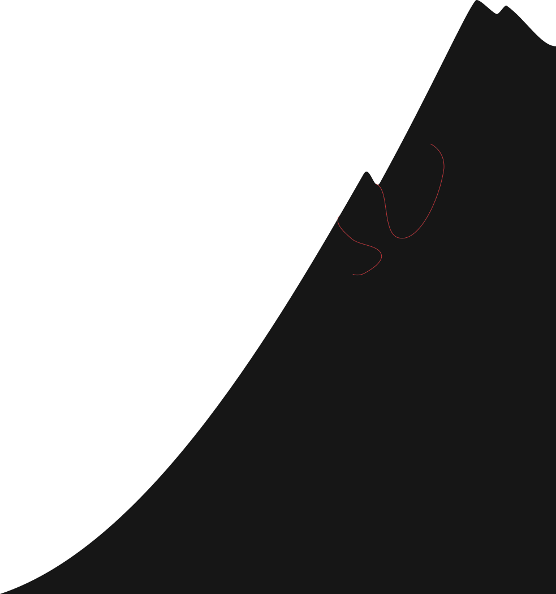

<a class="pbp-btn" href="http://scripta.co/in-orange-light/">Play now!</a>

 

Three years ago, surrounded by monitors in a dark, blue-hued room, a particular screen caught my eye. My girlfriend's (now wife's) eye was caught by the same screen, and we crossed the room to investigate.

We were visiting the _Indie Game Revolution_ exhibit at EMP in Seattle, and what we found on that screen was Scene I, Act I of [Kentucky Route Zero][kr0]. It took me three years, but I finally rediscovered KR0 a few weeks ago. Now, having (well, nearly) finished it, I'm convinced it's a masterpiece. The game's atmosphere is so rich, so effortlessly gripping, that _actually being there_ would be less compelling.

And they accomplished all that with 3D models my Amiga 500 could have rendered (sans lighting). Strategic omission of detail really has a way of setting fire to an imagination.

The atmosphere and storytelling from that game have been rolling around in my mind since then. With Ludum Dare 39 approaching, I'd decided to try my novice hand at recreating some of its techniques.

---



---

## Ludum Dare 39

Jared and I have participated in the Ludum Dare _Jam_ [three][ld35] [whole][ld37] [times][ld38], and we've been growing curious about the _Compo_ (aka, Hard Mode). Jared decided to sit this one out, so I took the opportunity to enter my first Compo, which is an exclusively solo endeavor. The theme was "Running out of power". Without any further ado, here is my game, [In Orange Light][iol].

[View the Ludum Dare entry][ldiol]

---

## Day 1, the foundation

With Kentucky Route Zero fresh in my mind, I wanted to branch out from my usual arcade-style game and try to make something a little more moody and atmospheric. Based on the "running out of power" theme, my idea was a survival game where you try to balance scant resources to survive winter in a frigid mountain cabin.

To get the math out of the way, I spent the first day implementing a basic simulation of warmth, food, fuel, a generator, heater, and all their interactions. I also created some placeholder art, so I'd have something to click on and cringe at.

---

## Day 2, some polish

I spent about half of Sunday improving the visuals, and the other half fixing bugs in the simulation I'd created on Saturday.

### Making it mountainous

Starting with a set of rectangles, and using a photo of the Blue Ridge Mountains as a reference, I tweaked vector paths into something resembling mountains.

### Sunrise, day, sunset, night, repeat

The plain blue mountains lacked luster, and a day/night cycle seemed like a fitting way to bring them some life.

I made the mountain sprites greyscale and multiplied them against two very tall, sliding sky gradients. Here's a visual of the technique, zoomed way out so you can see the two sky images playing leap frog as they slide up the screen. (This is a live demo of the game code, not a video.)

<figure id="iol-sky-demo"></figure>

To see the full sky sunrise and sunset, give [In Orange Light][iol] a play, but don't dismiss the text. That way, time will be paused and you won't starve or freeze.

### Sound effects

The game has a few sound effects. The heater's electric hum, the generator's rumble, and the growing, clawing sound of hunger. To create these, I used [BeepBox][bbox], a chiptune music sequencer. It's meant for music, but I was able to coax some sound effects out of it. Here are two of the sound effects, hit `Play` to hear them through the BeepBox synthesizer live on this page.

    

        <button id="generator">Play</button> Generator  <small><a href="http://beepbox.co/#5s7k0l00e00t7m1a7g00j0i1r1w81445111f30222000d11000101c00023000h40000000v20214050o3000b8p1xkNVAWE6CCIdttddsB1xkn3qmrx-GabxL0">(view in BeepBox)</a></small>
    

    

        <button id="heater">Play</button> Heater  <small><a href="http://beepbox.co/#5s7k0l00e00t7m1a7g00j0i1r1w81445111f30222000d11000101c00023000h40000000v20214050o3000bgp1xkNVAWE6CCIdttddsB1xkn3qmrx-GabxL0">(view in BeepBox)</a></small>
    

BeepBox is a very approachable sequencer. Here's what the "generator ran out of fuel" sound effect looks like inside the tool.

---

## Lessons learned

First, working solo is much harder than working on a team, and not only because a team can get more work done. Maintaining the sense of urgency, productivity, and focus was nearly impossible without a co-conspirator.

Second, system-of-numbers games need careful design and planning. In Orange Light is essentially a small spreadsheet where you click buttons in order to keep some numbers within a desired range. It seemed very simple at first, but a slew of miscalculations arose after I _thought_ I had finished the simulation.

Third, and unsurprisingly, immersion and atmosphere are very difficult to execute on. Still, as a first experiment, I'm pretty happy with how things turned out.

Fourth, and last, if a game has _meters_, and those meters indicate how Good/Bad something is, make sure they all go in the same direction. In my game, the Warmth meter wants to be high, and the Hunger meter wants to be low. That's been the single biggest point of absolutely understandable confusion.

Lessons learned!

<!-- IOL sky demo -->

<!-- /IOL sky demo -->

[kr0]: http://kentuckyroutezero.com/
[iol]: http://scripta.co/in-orange-light/
[ldiol]: https://ldjam.com/events/ludum-dare/39/in-orange-light
[jared]: https://twitter.com/caramelcode
[ld35]: http://ludumdare.com/compo/ludum-dare-35/?action=preview&uid=91554
[ld37]: http://ludumdare.com/compo/ludum-dare-37/?action=preview&uid=91554
[ld38]: https://ldjam.com/events/ludum-dare/38/pity-about-earth
[bbox]: http://beepbox.co
