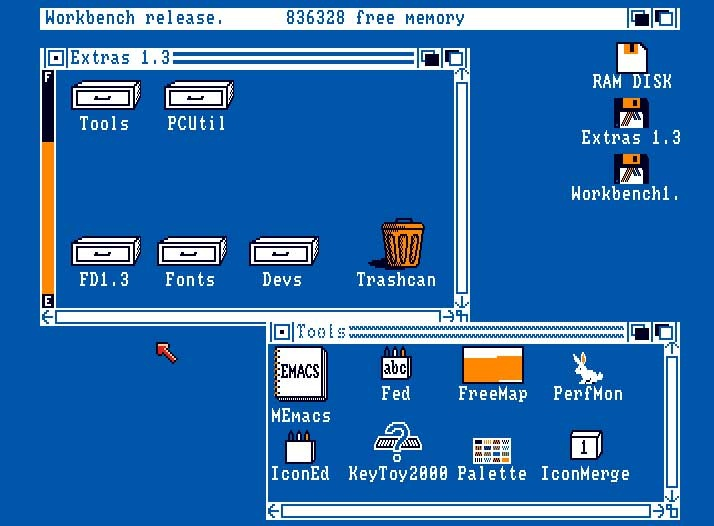



## Backstory

Popup Showdown is a game I created during [Open Jam 2017][oj17]. As an organizer of Open Jam, I wasn't planning to make a game, and certain wouldn't submit one to the competition, but as participants were hard at work on their games, I wanted to join in the fun. The game needed to be bad by design, to avoid taking any attention away from the _good_ games created by Open Jammers.

Over the course of a few hours, I familiarized myself with decades-old rules on popup creation in JavaScript and was pleased[^1] to find that it is indeed possible to control the screen position and size of a popup.

For no particular reason, I chose an Amiga Workbench aesthetic.

[^1]:

  "Pleased" because it enabled the game to be created, but dismayed that popups are/were a thing.

[oj]: http://openjam.io
[oj18]: https://itch.io/jam/open-jam-2018
[oj17]: https://itch.io/jam/open-jam-1
