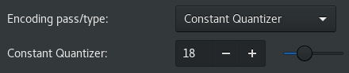

My first experience with [PiTiVi][ptv], eight years ago, was discouraging. Until my dad rediscovered it a few days ago, I hadn't thought of giving it a second chance. I'm glad I did. I've been extremely impressed with the improvements. PiTiVi's formerly rough edges have been sanded down, and what remains is an approachable, capable video editor perfectly suited to hobbyist uses.

One of the few remaining rough edges is low-quality defaults when it comes to rendering quality. Without tweaking settings, you'll have artifacts the size of your fist.

Here are a few steps to dramatically improve the video quality. I'm no expert on codecs or compression or [constant quantization][crf], but this should be a good embarkation point on the quest for perfect video.



# Steps

## 1. Install x264

    
Fedora/RHEL/CentOS:

    <pre><code>sudo dnf install x264</code></pre>

    
Debian/Ubuntu:

    <pre><code>sudo apt-get install x264</code></pre>

---

## 2. Choose codec: x264enc

Presuming you have a project ready to render, click _Render_ and select **x264enc** under the _Codec_ dropdown. x264enc is only available if your container format is set to _MP4_.

---

## 3. Select Constant Quantizer encoding

Just underneath the _Codec_ dropdown is an _Advanced_ button. Click it, and pick the following settings.

- Set **Encoding pass/type** to "Constant Quantizer"
- Set **Constant Quantizer** to 18

For more information on what this means, check out this [CRF/CQP][crf] explainer. In the explainer, the term CQP equates to "Constant Quantizer" in PiTiVi, and CRF equates to "Constant Quality". For some reason, I've been unable to get "Constant Quality" to produce good results, even though in theory it should be just as good, with smaller filesize.

## 4. Before & After

Here's a before & after video showing the quality difference after making these changes.



The difference in the smoothness of the gradients is pretty dramatic.

[ptv]: http://www.pitivi.org/
[crf]: https://slhck.info/video/2017/02/24/crf-guide.html
