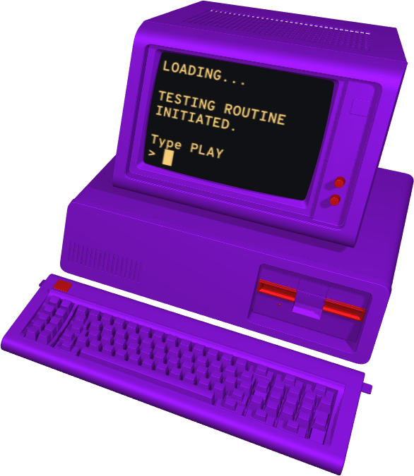
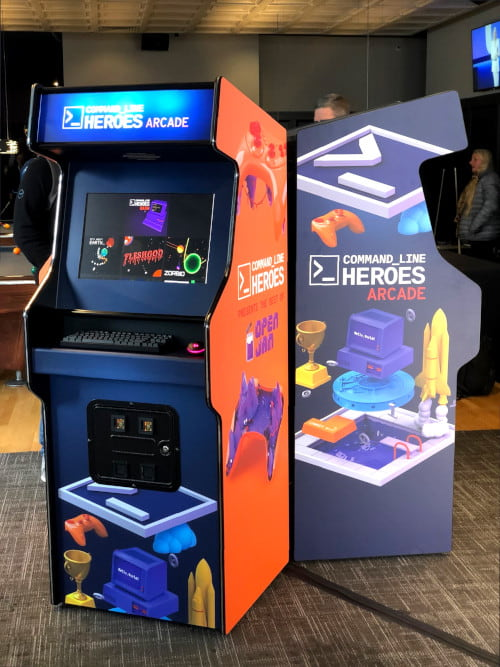

## Summary

Command Line Bash is a game that challenges you to type in as many commands as you can in 60 seconds.

<a class="pbp-btn" href="https://www.redhat.com/en/command-line-heroes/bash/index.html">Play now!</a>

My frequent co-conspirator [Jared Sprague][jsprague] and I created Command Line Bash, along with tremendous help from the [Command Line Heroes podcast][clh] team, open source contributors, and the [CLH Discord][discord] community.

If you're into code, you're welcome to [view source][source].  Contributions welcome!

---

## How to play

The game walks you through the instructions before you play, but here are the basics.  You will be challenged to type in as many commands as you can in 60 seconds.  Commands can be drawn from any of the following languages.

 - bash shell commands & Linux built-ins
 - JavaScript keywords, objects, functions
 - Python keywords, objects, functions
 - HTML5 tags

The leaderboard isn't networked, so we can't see your high scores unless you share them with us on Twitter!  Tag [#CommandLinePod][clh-tw].

 <!--style="
width: 100%;
display: grid;
grid-template-columns: 1fr 1fr;
grid-gap: 10px;
"-->





---

## Why we made it

About a year ago, one of the originators of Command Line Heroes, Dan Courcy, contacted Jared and me after seeing some of [our games][scripta].  After chatting for a while, the idea came up of creating a game based on Command Line Heroes (that name sure sounds like a videogame, doesn't it?).

A few months later, we were neck-deep in code for a new adventure game engine called [Hero Engine][hero-eng]. Sadly, we made the same discovery many gamedevs already knew: adventure games are _very time-consuming_ to create, *especially* when you start by building an engine from scratch.  To scale back, we decided to build a new game in more of a game-jam style, one with a much smaller scope.  Our goal was to complete it in time for [IBM Think][think], where we would first present the game to the world.

The strategy succeeded, and we were able to put the finishing touches on the game just before Think began.  Here's a bit about Bash @ Think.

---

## Cabs and confs

Not one to settle for the ordinary, Dan wanted to go the extra mile and present the game in full-sized arcade cabinets.  Fortunately, through participation in [geekSPARK][geekspark], I'd met Bill Culverhouse.  Bill is a maker extraordinaire, geekSPARK veteran, and happens to run an arcade cabinet construction company, [Triangle Home Gamerooms][trihg].

We met with them, toured their impressive factory, determined specs, and placed the order.

Here's what they built for us.

Notice the shout-out to [Open Jam][oj] (our <abbr title="free and open-source software">FOSS</abbr>-themed game jam) on the orange side of the cabinets!  If you look closely at the screen, you can spot a few games in the launcher.

 - [CLH Bash][game]
 - [Pity About Earth...][pae]
 - [Fleshgod][fleshgod]
 - [Zorbio][zorb]

Several more games are below the fold.

As I'm writing this, Think has just concluded and was a huge success for the Command Line Heroes team.

---

## What's next?

Here are some ways to get involved.

 - <a href="https://www.redhat.com/en/command-line-heroes/bash/index.html">Play the game!</a>
 - [Join the Discord server][discord]
 - [Check out the code][source]

[game]: https://www.redhat.com/en/command-line-heroes/bash/index.html
[source]: https://github.com/CommandLineHeroes/clh-bash
[scripta]: http://scripta.co
[hero-eng]: https://github.com/CommandLineHeroes/hero-engine
[clh]: https://www.redhat.com/en/command-line-heroes
[jsprague]: https://twitter.com/caramelcode
[discord]: https://discord.gg/DYEGmFc
[phaser]: https://www.phaser.io/phaser://www.phaser.io/phaser3
[tiled]: https://www.mapeditor.org/
[spec]: https://github.com/CommandLineHeroes/hero-engine/blob/master/doc/spec.md
[think]: https://www.ibm.com/events/think/
[trihg]: https://www.trihg.com/
[oj]: http://openjam.io
[fleshgod]: https://itch.io/jam/open-jam-2018/rate/314668
[pae]: http://pae.fun
[zorb]: https://zorb.io
[clh-tw]: https://twitter.com/hashtag/commandlinepod?src=hash
[geekspark]: /tags/geekspark/
