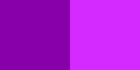

This morning, my manager presented me with a challenge: write some code to alternate letter colors.  I offered to implement it using only CSS.

CHALLENGE ACCEPTED!

We agreed on the terms:

 - No JavaScript
 - The text could be wrapped in a `div` or `span`, but no other markup could be used

I started by finding out if there is an `nth-letter()` selector yet.  Nope.  That's okay, my backup plan was to use `mix-blend-mode` to apply an image's colors to the text below.  After quite a bit of experimentation, I came up with this:



Originally, I was using a 2x1 SVG like this one, with both colors.

CSS with alternating letter colors.

## Pros and Cons

### Cons

It can only be used with monospace fonts because it relies on predictable character widths.

It only works on white backgrounds, because black is the only color that won't have the `multiply` blend mode applied.

[Wes Ruvalcaba][wesruv] offered two big improvements:

 - `em`-based width, which enabled the letter coloring to scale properly at all zoom levels and font sizes
 - replacing the image file with a CSS-based linear gradient

[wesruv]: http://www.wesruv.com/
