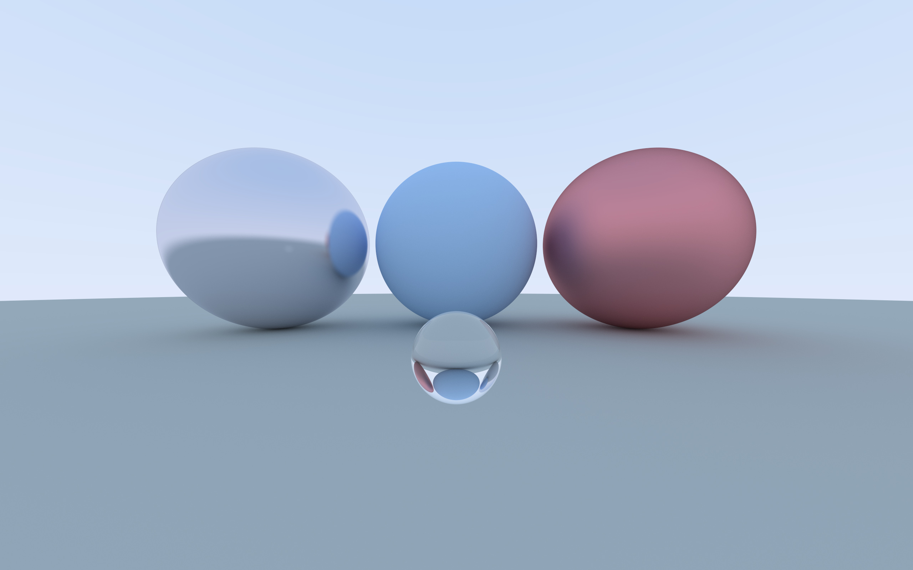

Back in college, two classes stand out as my favorites from from NCSU's computer science curriculum.  One was x86 assembly (CSC 236).  The other was computer graphics (CSC 461), where we wrote a software rasterizer, as well as a ray tracer (which I never finished 😅).

In the 16 years since, I've been working in web development, a space which I enjoy, but I've started to lament losing touch with more bare-metal areas of computer programming which had captured my interest so much in college.

The lecturer who taught the x86 assembly course, Dana Lasher, retired recently.  When I heard that, I decided to start a fun side project in honor of him and the inspiration he gave me.

---

## Choosing a project

But what to do?  After some thought, there was only one choice: finish the ray tracer.

I dusted off my graphics projects.  To my surprise, despite being compiled on Linux Mint in 2009, the rasterizer binary still ran on Fedora 34 in 2021!

<div class="beside">
    <figure>
        
        <figcaption>My rasterizer on Linut Mint, 2009</figcaption>
    </figure>
    <figure>
        
        <figcaption>My rasterizer on Fedora 34, 2021</figcaption>
    </figure>
</div>

It looks like the 2021 render has grown some new artifacts.  Bit rot, I guess. I'm just impressed that it ran at all, having been written on another distro, 12 years prior, by a complete novice at C++.

The ray tracer is another story.  I didn't even try running it again because what I _did_ write was horribly inefficient.  Here are some screenshots for evidence.

<div class="beside">
    <figure>
        <picture>
          <source srcset="./csc461/test_view.avif" type="image/avif">
          <source srcset="./csc461/test_view.webp" type="image/webp">
          
        </picture>
        <figcaption>The reference image.  Yes, this is rasterized, not ray traced.  I don't know why.</figcaption>
    </figure>
    <figure>
        
        <figcaption>One dot.</figcaption>
    </figure>
    <figure>
        
        <figcaption>Quite a few dots.</figcaption>
    </figure>
    <figure>
        
        <figcaption>Almost there, but the filename "overnight.png" conveys how inefficient this was.</figcaption>
    </figure>
</div>

The final image above is a tiny `200x130` pixels, with spotty ray coverage, that took over 8 hours to render.  That's _including_ required optimizations like a [kd-tree](https://en.wikipedia.org/wiki/K-d_tree) for spatial filtering. Charitably, you could call the performance _suboptimal_.


<svg class="float-comp" height="144" width="144" xmlns="http://www.w3.org/2000/svg"><path d="m71.05 23.68c-26.06 0-47.27 21.22-47.27 47.27s21.22 47.27 47.27 47.27 47.27-21.22 47.27-47.27-21.22-47.27-47.27-47.27zm-.07 4.2a3.1 3.11 0 0 1 3.02 3.11 3.11 3.11 0 0 1 -6.22 0 3.11 3.11 0 0 1 3.2-3.11zm7.12 5.12a38.27 38.27 0 0 1 26.2 18.66l-3.67 8.28c-.63 1.43.02 3.11 1.44 3.75l7.06 3.13a38.27 38.27 0 0 1 .08 6.64h-3.93c-.39 0-.55.26-.55.64v1.8c0 4.24-2.39 5.17-4.49 5.4-2 .23-4.21-.84-4.49-2.06-1.18-6.63-3.14-8.04-6.24-10.49 3.85-2.44 7.85-6.05 7.85-10.87 0-5.21-3.57-8.49-6-10.1-3.42-2.25-7.2-2.7-8.22-2.7h-40.6a38.27 38.27 0 0 1 21.41-12.08l4.79 5.02c1.08 1.13 2.87 1.18 4 .09zm-44.2 23.02a3.11 3.11 0 0 1 3.02 3.11 3.11 3.11 0 0 1 -6.22 0 3.11 3.11 0 0 1 3.2-3.11zm74.15.14a3.11 3.11 0 0 1 3.02 3.11 3.11 3.11 0 0 1 -6.22 0 3.11 3.11 0 0 1 3.2-3.11zm-68.29.5h5.42v24.44h-10.94a38.27 38.27 0 0 1 -1.24-14.61l6.7-2.98c1.43-.64 2.08-2.31 1.44-3.74zm22.62.26h12.91c.67 0 4.71.77 4.71 3.8 0 2.51-3.1 3.41-5.65 3.41h-11.98zm0 17.56h9.89c.9 0 4.83.26 6.08 5.28.39 1.54 1.26 6.56 1.85 8.17.59 1.8 2.98 5.4 5.53 5.4h16.14a38.27 38.27 0 0 1 -3.54 4.1l-6.57-1.41c-1.53-.33-3.04.65-3.37 2.18l-1.56 7.28a38.27 38.27 0 0 1 -31.91-.15l-1.56-7.28c-.33-1.53-1.83-2.51-3.36-2.18l-6.43 1.38a38.27 38.27 0 0 1 -3.32-3.92h31.27c.35 0 .59-.06.59-.39v-11.06c0-.32-.24-.39-.59-.39h-9.15zm-14.43 25.33a3.11 3.11 0 0 1 3.02 3.11 3.11 3.11 0 0 1 -6.22 0 3.11 3.11 0 0 1 3.2-3.11zm46.05.14a3.11 3.11 0 0 1 3.02 3.11 3.11 3.11 0 0 1 -6.22 0 3.11 3.11 0 0 1 3.2-3.11z"/><path d="m115.68 70.95a44.63 44.63 0 0 1 -44.63 44.63 44.63 44.63 0 0 1 -44.63-44.63 44.63 44.63 0 0 1 44.63-44.63 44.63 44.63 0 0 1 44.63 44.63zm-.84-4.31 6.96 4.31-6.96 4.31 5.98 5.59-7.66 2.87 4.78 6.65-8.09 1.32 3.4 7.46-8.19-.29 1.88 7.98-7.98-1.88.29 8.19-7.46-3.4-1.32 8.09-6.65-4.78-2.87 7.66-5.59-5.98-4.31 6.96-4.31-6.96-5.59 5.98-2.87-7.66-6.65 4.78-1.32-8.09-7.46 3.4.29-8.19-7.98 1.88 1.88-7.98-8.19.29 3.4-7.46-8.09-1.32 4.78-6.65-7.66-2.87 5.98-5.59-6.96-4.31 6.96-4.31-5.98-5.59 7.66-2.87-4.78-6.65 8.09-1.32-3.4-7.46 8.19.29-1.88-7.98 7.98 1.88-.29-8.19 7.46 3.4 1.32-8.09 6.65 4.78 2.87-7.66 5.59 5.98 4.31-6.96 4.31 6.96 5.59-5.98 2.87 7.66 6.65-4.78 1.32 8.09 7.46-3.4-.29 8.19 7.98-1.88-1.88 7.98 8.19-.29-3.4 7.46 8.09 1.32-4.78 6.65 7.66 2.87z" fill-rule="evenodd" stroke-linecap="round" stroke-linejoin="round" stroke-width="3"/></svg>

To make things right, first I needed to choose a language.  I picked [Rust](https://www.rust-lang.org/).  I'd dabbled here and there, but never written anything more than a few dozen lines.  It's fast, fun, and has outstanding learning material.  Perfect.

Next, I dug through my bookmarks for [Ray Tracing in One Weekend](https://raytracing.github.io/), a guide by Peter Shirley on writing ray tracers.  His example code is in C++, which was great as I really didn't _want_ to jot down someone else's code.

---

## The Colorful Parts

Long story short, I completed a Rust implementation of the first book of Peter Shirley's series.  The result is a ray tracer with a movable camera, sphere intersection, three materials (diffuse, reflective, and glass), antialiasing, and bokeh.

I learned a lot and had a blast, and it took way longer than one weekend.  Here are some renders during development.

I call it: **Ray Tracing in Five Weekends**





<style>
.float-comp {
  float: right;
  shape-margin: 1em;
}
.float-comp path {
  fill: rgb(220,44,12);
  stroke: rgb(220,44,12);
}
</style>

<figure>
  <picture>
    <source srcset="./overnight-equivalent.avif" type="image/avif">
    <source srcset="./overnight-equivalent.webp" type="image/webp">
    
  </picture>
</figure>

---

## The Hard Parts

I got tripped up by Rust's module system, on the syntax for overloading arithmetic operators, and by the borrow checker countless times.  I think the most interesting challenge I had was with generic numbers.

### Programming with generic numbers

Writing functions for handling numeric types generically was a challenge I'd first encountered when dabbling in Rust with [Project Euler](https://projecteuler.net/).  For example, if I wrote a function to test whether a number was prime, I might have it accept a `u64`, but then if I want to avoid casting, I need to make sure every number I may want to test for primality must also be `u64`.  That causes `u64` to spread virally through the codebase.

To avoid that, I wanted to try [Rust's generics](https://doc.rust-lang.org/book/ch10-01-syntax.html).  I figured there must be a way to define a function that could accept, say, "any floating-point type", or "any unsigned integer type", regardless of precision.

I set about looking for generic number [traits](https://doc.rust-lang.org/book/ch10-02-traits.html) in the standard library. I was surprised when I found none.  What I did find is the [num-traits](https://docs.rs/num-traits/0.2.14/num_traits/) crate, a collection of "Numeric traits for generic mathematics".

Whiel writing this post, I noticed the lead maintainer of num-traits is fellow Red Hatter [Josh Stone](https://github.com/cuviper)! I reached out and thanked him for his work.  I also asked if he thought generic numeric traits would ever get folded into the Rust standard library, where I'd first gone looking.

He responded "Fun fact, they **came** from the standard library, pre Rust 1.0."

Apparently the traits had been pulled _out_ of standard library in preparation for Rust 1.0 because the Rust devs weren't ready to stabilize them yet.  Josh has kept them stable since then.

He explained that stabilizing traits is tricky, because the rust compiler requires that all trait functions be implemented.  Take this pretend trait, `Fuzzy`, which pertains to the fuzziness of animals.  You can add functions with default implementations to Fuzzy all day long without causing any breaking changes for anyone using your trait.

```rs
trait Fuzzy {
  fn fuzziness(&self) -> u32 {
    10
  }
}
```

But this default implementation doesn't make sense, because an animal's fuzziness is individual.  It really needs to be in an `impl` so it can be specific to the animal.

```rs
trait Fuzzy {
  fn fuzziness(&self) -> u32;
}

// meanwhile, in a user's codebase...

impl Fuzzy for Sheep {
}
```

Since there is no `impl` for the fuzziness function, the rust compiler emits the following error.

<pre><code style="color: var(--pbp-error-color, #ff5353)">impl Fuzzy for Sheep {}
^^^^^^^^^^^^^^^^^^^^ missing `fuzziness` in implementation
</code></pre>

And that's why numeric traits don't exist in the Rust standard library.

During this discussion it occurred to me that there could potentially be a name conflict between a function in a struct's impl, and a trait function implemented for that struct.  I asked Josh about this as well, and the discusison led to some [docs on disambiguating function calls](https://doc.rust-lang.org/reference/expressions/call-expr.html#disambiguating-function-calls).  He said that while there is some chance for name conflicts, it's generally not considered a breaking change because of the low liklihood, whereas adding a trait function without a default impl is guaranteed to break the builds of your users.

---

## Rust resources

This was a really fun project, and I could go on about what I learned for another hundred pages.  I learned a lot, got stuck a lot, got familiar with the outstanding Rust resources on offer (especially [The Book](https://doc.rust-lang.org/book/) and [Rustlings](https://github.com/rust-lang/rustlings)). I discovered [Jon Gjengset's truly excellent videos](https://www.youtube.com/channel/UC_iD0xppBwwsrM9DegC5cQQ) too late for this project, but I'm happily consuming them now.  He's a great educator.

This post was mostly about Rust, but the ray tracing side of the project was equally fun.  I can't recommend [Ray Tracing in One Weekend](https://raytracing.github.io/) highly enough, it's a really accessible step-by-step guide through the principles of ray tracing.  It is _so exciting_ seeing something render for the first time.

And a special shout out to the Rust community at Red Hat for patiently fielding my questions even though I'm quite sure they had better things to do!

---

## Future work

The next step for the ray tracer is to compile it to WebAssembly so it can be demoed here on this very blog. [wasm-pack](https://rustwasm.github.io/wasm-pack/book/introduction.html) makes this easy, but I will have to do some refactoring.  For example generic types aren't supported by [wasm-bindgen](https://rustwasm.github.io/docs/wasm-bindgen/), so I'll have to remove all the generics I so painstakingly included.  It's no big loss; my hobby ray tracer doesn't _need_ generic numbers.  The value is in the learning, not in the having.

<picture>
  <source srcset="./wasm-ferris.avif" type="image/avif">
  
</picture>

After WebAssembly, I'd like to add parallelism.  Surely it will be as simple as changing every `Rc` to `Arc`.

The next step for me on my Rust journey is to come to understand [lifetime annotations](https://doc.rust-lang.org/book/ch10-03-lifetime-syntax.html#lifetime-annotation-syntax).  They came up several times during this project.  The compiler helped me to a solution, but I didn't reach a deep understanding.


