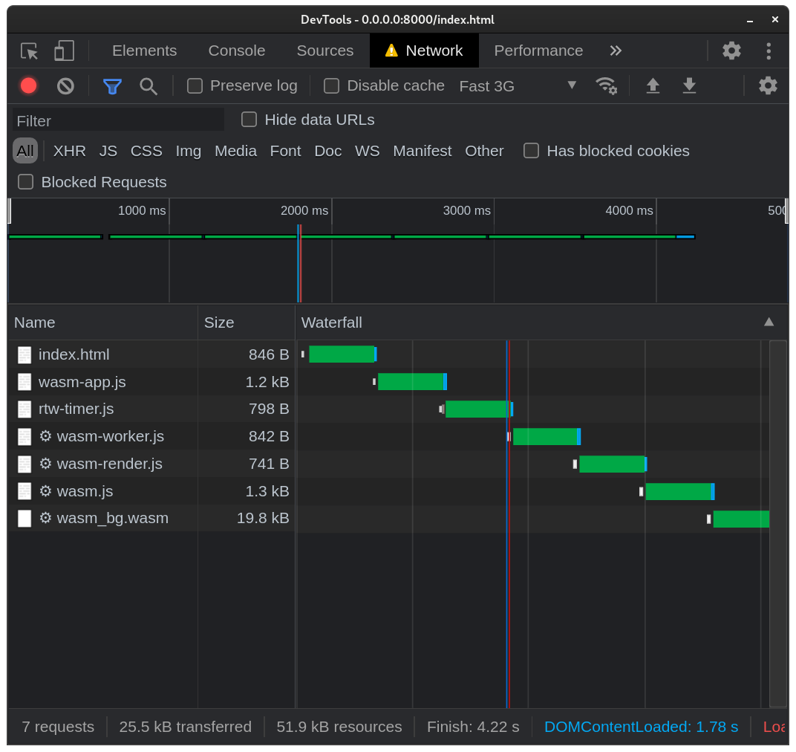
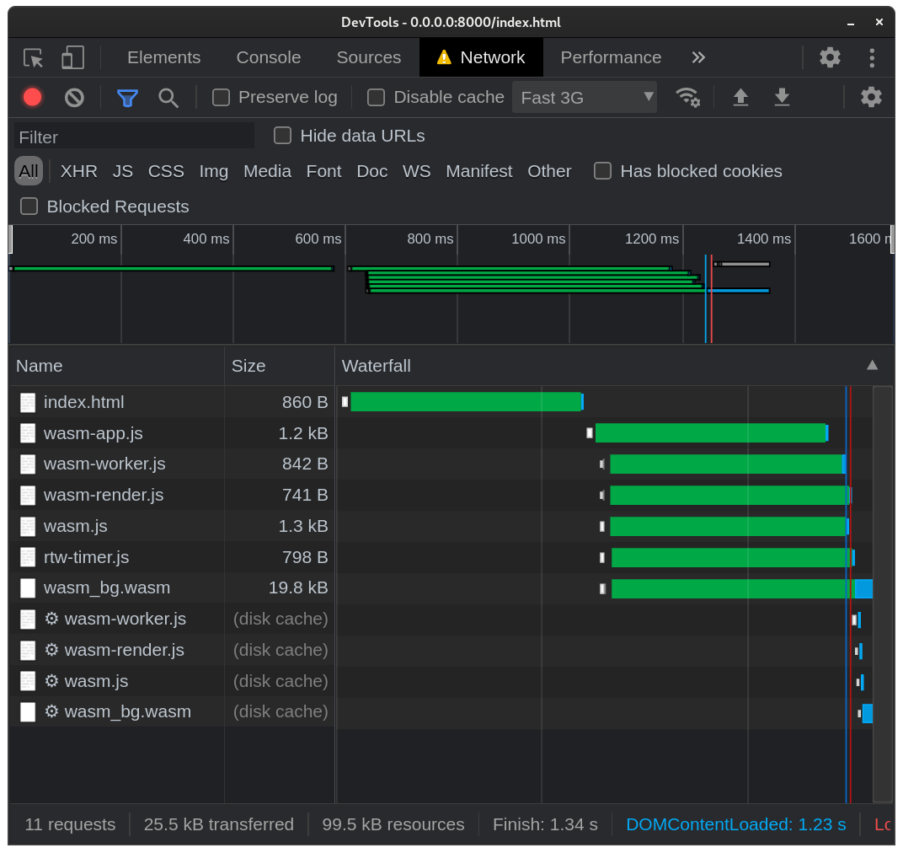

<script async type="module" src="./rtw-render/dist/rtw-render.js"></script>

## What and why

This post is brought to you by the letter W.

My [last post]() covered writing a ray-tracer in Rust.  This post covers getting that ray-tracer running in WebAssembly.

<style>
rtw-render {
  --rtw-background-color: var(--pbp-bg-color);

  border: 1px solid var(--pbp-fg-color);
}
</style>
<rtw-render></rtw-render>

## The WWWWWW Pattern

The demo above is a WebAssembly module running inside a Web Worker, Wrapped in a Web Component... on a Web Site, in a Web Browser.  Others are using this same pattern, but to my knowledge it doesn't yet have a silly name.  So, I'm dubbing it the **WWWWWW** pattern.  Too many syllables, you say?  I'm just following in the footsteps of the man himself.

<figure>

<figcaption>Tim Berners-Lee, Weaving the Web</figcaption>
</figure>

If the World Wide Web only had a few more W's, maybe it would have caught on!

Silly names aside, Web Components and Web Workers do complement WebAssemebly beautifully.  I'd like to write more about WWWWWW, but that'll be a topic for another post.  Back to the ray tracer.

To set the scene, here's what was in place

 - one Rust ray tracer, as a single binary crate
 - one bookmark to [wasm-pack][wasm-pack]
 - one mistaken assumption that could ruin everything

First, the bad assumption.  The ray tracer makes [heavy use of generic numbers](), which posed a problem, since I'd read that wasm-bindgen does not support generics.  I was afraid that having to pull _out_ all the generics in the program would make this wasmification into too much work for a late-night side project.

Fortunately, I'd only de-generic'd a single file before folk hero [u/FruitieX][fruitiex] shared [a correction][generic-correction]: generics are only unsupported in things that sit on the wasm/JS boundary.  In this case, only a single `render` function would need to be available to JS, and that function hadn't been written yet, so my concern about generics evaporated immediately.  Ruin averted.

## single crate into three crates

At the end of the previous post, the ray tracer was implemented in a single binary crate.  To re-use that code for a WebAssemebly target as well, the first thing I did was move the ray tracing code into a library crate.

The original binary crate then imported the library crate, so the ray tracer can still be run on the command line.  I created a third crate, `wasm`, with wasm-pack.  This one also imports the library crate, does some small amount of extra work to make the ray tracing output consumable by WebAssemebly, and exports that function to wasm with `#[wasm_bindgen]`.

The extra work in question was a simple change in output format.  The result of the ray tracing is a `Vec<Vec3<f64>>`, or in plain English, an array of (R,G,B) colors with 64-bit precision.  Two of the types, `Vec` and `f64`, are core Rust types, which wasm-bindgen knows how to bind to JavaScript types.  `Vec3` is a custom type I wrote for the ray tracer.  As a result, the first error I encountered had to do with wasm-bindgen rejecting `Vec3` as an unkonwn type, since it had no idea how to convert it into JS.  Makes sense!  Now, it's absolutely possible to teach wasm-bindgen how to convert custom types into JS, but I was in a hurry to get things running, so I took the easy way out and simply flattened the `Vec<Vec3<f64>>` into a `Vec<f64>`, taking my custom type out of the equation.  This involved copying data, which I was concerned would impact performance, and for sure it's an inefficient step, but it was so utterly eclipsed by other performance bottlenecks that I'm glad I didn't spend type pre-optimizing it.


## Performance

Performance was the thing I was most interested in observing, and my expectations were that the ray tracer would run at nearly-but-not-quite bare metal speeds.  After the previous steps, the ray tracer was

### rand RNG perf cost and my attempts to solve it
### page perf while rendering, ie WWWWWW

Getting the WebAssemebly module running quickly was a brand new experience for me, but doing a bunch of front-end webby stuff to get the wasm module loaded quickly, that's familiar stuff!

For visual reference, here's the waterfall at 3G speeds, from the point in time when I first got the wasm module into a good, fast state.  In the waterafll, you'll see as perfect a staircase (not a good thing) as I've ever seen.

**Before**


 1. `index.html` loads `wasm-app.js`, the main entrypoint
 2. `wasm-app.js` loads `rtw-timer.js`, the component that displays running time
 3. `wasm-app.js` imports the Web Worker, `wasm-worker.js`
 4. `wasm-worker.js` imports `wasm-render.js`, the module responsible for running wasm-pack's output.  `wasm-render.js` can be run either within a Web Worker or without, enabling the ray tracer to run in browsers that don't support module workers, like Firefox.
 5. TODO wasm.js
 6. TODO wasm_bg.wasm

**After**


## What's next

## Raw notes

 - wasm-pack, wasm-bindgen, wasm-opt are awesome.
 - refactored the single crate into three crates, `lib`, `cli`, and `wasm`.
 - returning Vec<Vec3<f64>> didn't work, flattened to Vec<f64>, it was easier than
   - could have read more about js-sys to figure out how to return a uin8clampedarray, but just wanted to get it working.
 - performance was terrible.  measured between 12x and 60x slower than native binary.
   - tried every optimization level, s, z, 0-3
   - is it caused by copying Vec<Vec3<f64>> data into a flat Vec<f64>?
   - WTF: rendering _while profiling_ with chrome devtools, it runs in ~840ms.  rendering without profiling, it runs at about 2250ms. still have no idea why.
     - [@rictic](https://twitter.com/rictic/) suggested opening a chromium bug.  The response was that this is expected behavior, because when devtools is open, webassembly runs in the [Liftoff tier](https://v8.dev/blog/liftoff), which enables better inspection of the wasm engine, for debugging and so on.  The big surprise for me was that when the profiler is running, the speed returns to normal.  The answer surprised me because the profiler surely needs to inspect the wasm engine to get timings, stacks and symbol names, etc.  But one thing that the profiler does _not_ do is process breakpoints.  The debugger is disabled while profiling, which probably accounts for the speed difference.  While profiling, webassembly is elevated to the faster TurboFan tier.  The more you know.
 - took a cruise through prng packages.  from rand, to wyhash+rand_core, to pure getrandom, and back to rand. might revisit wyhash later for performance, or pregenerate a list of random numbers (if it doesn't bulk up .wasm filesize too much).
   - thanks to demangled names, devtools flame chart is extraordinarily helpful in debugging wasm performance issues.
        ```
        [package.metadata.wasm-pack.profile.release.wasm-bindgen]
        demangle-name-section = true
        ```
   - the terrible performance seems to stem from random number generation.  when `rand` is used with wasm-bindgen, it calls into JS land `crypto.getRandomValues` to generate random numbers.  this accounted for 80% of the program's work was generating random numbers.
   - still have no idea why it ran so much faster _while profiling_.
   - looking for a fast rust-only prng.  does not need to be secure.[lehmer](https://lemire.me/blog/2019/03/19/the-fastest-conventional-random-number-generator-that-can-pass-big-crush/) looks good.  but to implement that we need a way to have a mutable variable at the top level of a rust module.  generators would be a fun way to go, but I don't see a way of making a pub generator.
   - even for rand, I was looking for a way to avoid creating a new rng every time random_float is called.  I want to try using the `cached` crate on a `get_rng` function to see if it properly memoizes it.  should speed things up nicely. can't get it to work with mut, and rngs must be mut.  rand wants to be unsafe.
   - trying a real bummer of an approach: initializing an rng in main() and passing it down the long waterfall of functions.  too awkward, giving up.
   - trying to improve performance by using lazy_static to create a mutex-protected global mut rng.
     - first try: lazy_static on a mut u128 and use ultra-fast [lehmer64](https://lemire.me/blog/2019/03/19/the-fastest-conventional-random-number-generator-that-can-pass-big-crush/)
     - second try: lazy_static on a mut u128 and use ultra-fast [wyhash64](https://lemire.me/blog/2019/03/19/the-fastest-conventional-random-number-generator-that-can-pass-big-crush/)
     - both are crazy fast but lehmer seems faster.
     - idea: try the above with u64 instead.  security is not needed here, speed is priority.
     - idea: try to parallelize the rng.  both lehmer and wyhash update the seed in one step, which must be synchronized, but after the seed update, the rest of the algorithm can be par.
     - idea: try wyhash crate again instead of reimplementing it.
     - whether I impl wyhash or use the crate, I'll need to convert uint to float in [0..1).
       - n = wyhash(starting_seed)
       - f(n) => n / mag( n )
       - mag(n) => int( log10( n )+1 )
     - implementing lehmer.  needed to allow integer overflow for u128.  discovered [Wrapping](https://doc.rust-lang.org/std/num/struct.Wrapping.html).
     - lazy_static worked for shared mut u128.  lehmer worked for prng.  Wrapping with >> worked for bit shift.  dividing by 2^64 worked for converting to float.  result: ~325ms, or 2.5x faster.  I expected 160ms, 5x faster.
     - floatuntidf (128-bit int support) is taking 18.5% of the time.  according to [compiler-builtins](https://github.com/rust-lang/compiler-builtins) it's a c library in the process of being ported to rust.  try using u64 instead of u128. result: runs in 180ms, really close to the 5x improvement that I expected after removing `rand`!
     - I tried adding a precomputed prng with 100 random values, bombed.  tried 10,000 random values.  also bombed.  VERY bad image quality.  going back to lehmer.
     - now native is only marginally faster than wasm...
     - WAIT, almost the entire performance cost of random_float is  in locking and unlocking the mutex.  almost 20% of the running time is spent on mutex locks and unlocks.  see ./profile-showing-mutex-cost  JON HOO WAS RIGHT (link to his csail presentation where he talks about mutex perf costs)
     - ## WWW: Web Workers Work.  trying to make an accurate spinner, but the wasm locks up the main thread, so I'm going to try putting it in a web worker.  module worker, specifically.  module worker worked.
       - except in Firefox, which doesn't support module workers.  the worker runs, but can't import, so I modified it to catch the error and return an error message to the main thread.  the main thread then responds by running the renderer on the main thread.  the timer can't tick up anymore because the  main thread is blocked, so I add a message to indicate what's happening.
     - thank goodnessImageData is a supported type to pass to/from Web Workers: https://developer.mozilla.org/en-US/docs/Web/API/Web_Workers_API/Structured_clone_algorithm
   - after lazy_static and lehmer prng optimization, the time budget is dominated by the Sphere::hit detection, at 45% of runing time.  Ray::color is second at 19%, and lehmer prng is third at 18% (which is almost entirely mutex lock/unlock).  I'm curious to see how this compares to the native performance profile. (from ./profile-showing-mutex-cost we can see it's very similar).
 - for this post I tried something new which should have been obvious: keeping the notes open while working on the project and jotting.  typically I have two tmux panes open, one for nvim and one for running the program.  bumped it up to three.  it was incredible how much this helped when sitting down to write this post.  just from the note-taking, I already had almost 1200 words written.
 - I wanted to preload the resources, but when using modulepreload, the browser didn't like that some of the modules weren't used in the first few seconds.  additionally, wasm files can't be preloaded with link rel=preload.  my workaround to flatten the waterfall was simply to import() the modules and fetch() the wasm immediately.   importing didn't work well because it would execute the modules too, leading to double execution.  so I wound up fetching everything I needed to preload.
 - have a problem with my measurements here.  my earlier numbers, while evaluating 12-60s wasm slowdown due to rand, were run with quality at 100/66, 4 samples, depth 2, and my later numbers (benchmarks mostly, but also the flamegraphs) were at 300/200, 10 samples, depth 3.  I'll have to re-do something to make the numbers track throughout the blog post.  I think the best I can do is re-do the latest benchmarks at the lower quality.  the flamegraphs don't contain aboslute numbers, and all the measurements in question scale linearly with each other, so they should still be very accurate.
 - just noticed that I'm using Rc which is from `std`.  try to find an alternative that isn't from `std`, and see what size implications are.
   - trying to remove everything from std, there's more than I thought
   - trying out https://crates.io/crates/simple-mutex and https://crates.io/crates/spin-sync
     - sold on spin-sync.  it's 2kB smaller than std sync, and makes the whole program 22% faster!
   - trying to replace Rc with wrc.  didn't have the time, really.  Rc is everywhere.

## Native performance on long-running box

 - 399.2 ms ±   4.3 ms

captured over 30 runs with hyperfine.

```sh
$ hyperfine --warmup 3 './cli' -m 30
Benchmark #1: ./cli
  Time (mean ± σ):     399.2 ms ±   4.3 ms    [User: 397.0 ms, System: 1.3 ms]
  Range (min … max):   395.2 ms … 413.0 ms    30 runs
```

## WASM performance on long-running box

 - 452.05 ± 10.85

captured over 30 runs with devtools profiling, which seemed to be far more accurate than console.time and much more accurate than performance.now() subtraction.

13% slower than native.  not too shabby!

[wasm-pack]: https://rustwasm.github.io/wasm-pack/book/introduction.html
[generic-correction]: https://www.reddit.com/r/rust/comments/ocaiwb/there_are_many_like_it_but_this_one_is_my_rust/h3wjlf4/?utm_source=reddit&utm_medium=web2x&context=3
[fruitiex]: https://www.reddit.com/user/FruitieX/
