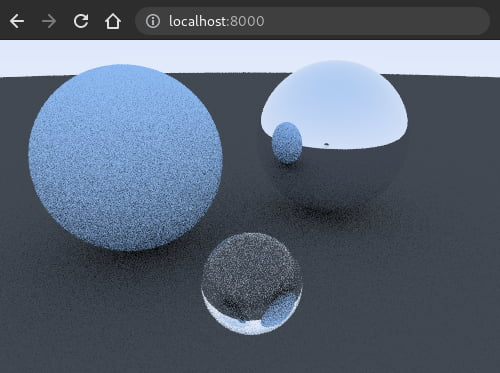
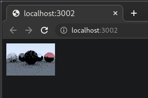
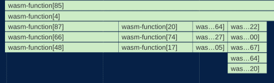
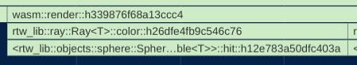
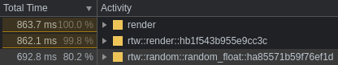

Rust.  A ray tracer.  The dream of WebAssembly.  One dangerous idea that could ruin everything.

This was the scene at the end of my [last post][prev], which covered creating a ray tracer in Rust using Peter Shirley's outstanding [Ray Tracing in One Weekend](https://raytracing.github.io/).  In the wrap-up to that post, I expressed an interest in creating a WebAssembly build of the ray tracer, and that project is what follows.

The process of targeting WebAssembly went well, overall.  The highlights of the journey were:

 - Refactoring crates to support both CLI and WebAssembly.

 - A staggering performance degradation caused by millions of excessive wasm-to-js calls.

 - A Rust implementation of a rather fast random number generator.

 - A staggering performance degradation caused by opening devtools.

Before diving in too deep, here's the end result.  This is my Rust ray tracer running right here in this blog post, at speeds pretty close to native. Image quality is kept low to keep renders fast (and to avoid burning through phone batteries).

<script async type="module" src="./rtw-render/dist/rtw-render.js"></script>

<style>
rtw-render {
  --rtw-background-color: var(--pbp-bg-color);
  border: 1px solid var(--pbp-fg-color);
}
#rtw-wrapper {
  display: flex;
  justify-content: center;
}
</style>
<div id="rtw-wrapper">
<rtw-render id="live-demo"></rtw-render>
</div>

<noscript>
<strong style="color: var(--pbp-error-color)">JavaScript appears to be disabled in your browser, so the WebAssembly demo can't initialize.  Here's what it would have looked like:</strong>
<picture>
  <source srcset="./thumb.webp" type="image/webp">
  
</picture>
<style>#rtw-wrapper { display: none }</style>
</noscript>

<center>

[View source][viewsource]

</center><br>

For fun, try re-rendering a few times to see the "noise" pattern change.  It's also interesting to watch the stats vary from run to run.  The total ray count changes due to randomness in how rays scatter off of surfaces.  With one random seed, a ray may hit a surface, causing another ray to spawn, while with another random seed, that same ray may miss the object entirely, terminating that ray sequence.  Randomness will come up a lot in this post.

---



## Crate refactoring

<style>
pfe-icon {
  --pfe-icon--Color: var(--pbp-fg-color, white);
}
@media (min-width: 750px) {
  #TableOfContents {
    float: right;
    padding: 16px;
    /* margin: 10px; */
    margin: 0 0 10px 20px;
    background-color: #242424;
  }
}
</style>

At the end of the [previous post][prev], the ray tracer could be run only on the command line.  In Rust terms, it was a binary crate.  To re-use that code for a WebAssembly target, the first thing I did was move most of the code into a library crate, so it could be shared.

The binary crate then imported the library crate, so the CLI could work just as it did before.  I then created another crate using [wasm-pack][wasm-pack], a fantastic tool for creating Rust-to-WebAssembly crates.  The wasm crate also imports the library crate and uses `#[wasm_bindgen]` to to export a `render` function to JavaScript.

In Rust land, `render()` returns a `Vec<u8>`.  In JS land, the `Vec<u8>` looks like a `Uint8ClampedArray`.  That slots perfectly into [`ImageData`][imagedata], which is then drawn into a `<canvas>` using [`putImageData()`][putimagedata].  You can peruse the code for the three crates at the [rust-raytracer-weekend repo][viewsource], and if you do, please let me know if you find anything to critique.

Thanks to [wasm-pack][wasm-pack] and [wasm-bindgen][wasm-bindgen] doing all the heavy lifting, that was all it took to get a working WebAssembly module!  Here's the first rendering.



The quality settings were at rock bottom, but it was still pretty exciting!

So, end of post, right?  Before saying goodbye, maaaybe we should see how good the performance is.

---

## Performance

Initially, the performance of the WebAssembly module seemed pretty good.  The quality settings were bottomed out to make the save/refresh loop tighter.  Once I turned the quality settings back up to their defaults, I was stunned.  The performance was awful.  The WebAssembly module ran **12x** slower than the native binary.  Under some conditions, I even saw it degrade to **60x** native speed.  I won't leave anyone in suspense though, WebAssembly's innate speed was not the cause.

The rest of the post covers why the performance was so poor, how I found the bottlenecks, and how I corrected them.

---

### Mangling shmangling

The first test I ran was a performance profile in Chrome devtools, which profiles JS and WebAssembly.  The results were... unhelpful.



wasm-pack docs helped out here.  Adding the two following settings to Cargo.toml resulted in more useful names.

```
[package.metadata.wasm-pack.profile.release]
wasm-opt = false

[package.metadata.wasm-pack.profile.release.wasm-bindgen]
demangle-name-section = true
```
Produced:

<figure>

<figcaption>
A more helpful profile with demangled names.
</figcaption>
</figure>

With the profile now usable, the first big bottleneck jumped off the screen.



`random_float`? 80%?  For some reason, generating random numbers taking up most of the oxygen in the room.  This is a ray tracer, not a crypto miner.  What gives?

---

### RNGesus Giveth and Taketh Away

The profile revealed that 80% of the ray tracer's activity consisted of calls to [rand][rand], an RNG crate.  I'd chosen rand because it had WebAssembly support, and includes no calls to the standard library, which tends to cut down on `.wasm` file size.  What I hadn't noticed until digging into the flame chart, is that when rand is in the WebAssembly context, it gets its initial seed with a call to JavaScript: [crypto.getRandomValues()][crypto-get].  And since I was poorly initializing rand, it was making _a lot_ of those calls.

Random numbers are needed throughout the ray tracer, and I didn't know of a way in Rust to create a single, global RNG that every corner of the program could make calls to.  Instead, I inefficiently initialized a new RNG every time a random number was needed.

This left me with two problems to solve.

 1. find a way to share a single RNG
 2. avoid excessive wasm-to-js calls

After a lot of experimentation, I settled on implementing the very-very fast [lehmer64][lehmer64], and making it "global" with [lazy_static][lazy_static].  I left a lot of other options on the table, such as using lazy_static to share rand.  The reasons were in the vein of simplicity, `.wasm` file size, and valuing speed over [cryptographically-bulletproof random numbers][csprng].

Here's what the lazy_static usage looks like.

```rust
lazy_static! {
    static ref RNG: Mutex<u128> = Mutex::new(0xda942042e4dd58b5);
}
```

  The only global piece is the starting seed, which gets rewritten by each call to `random_float`. Here's the [implementation of random_float using lehmer64][rust-lehmer].  The compiler noticed the potential for integer overflow, and politely asked me to add [Wrapping][wrapping] to indicate overflow was desired.  After adding Wrapping, the code worked.

With millions of wasm-to-js calls eliminated, performance improved, but not as much as I expected.

---

#### floatuntidf.c

The culprit, taking up 19% of total time, was [floatuntidf.c][floatuntidf].   It's a temporary C implementation of 128-bit integers in [compiler-builtins](https://github.com/rust-lang/compiler-builtins), and is being ported to Rust.  My guess is that the coercion of `u128` to `f64` activated floatuntidf.  Since top-shelf RNG quality isn't needed here, I lowered the precision to `u64/f32`, which made both `Wrapping` and `floatuntidf` unnecessary.  That's a free 19% performance boost with no noticeable change in image quality.

---

#### Nearly native

Now, the WebAssembly module's speed was breathing down the neck of native!  In the following benchmark, WebAssembly ran at 1.13x native speed.
☠

| Target | Average total time | Standard deviation |
| --- | --- | --- |
| Native | 399.20 ms | ± 4.30 ms |
| WebAssembly | 452.05 ms | ± 10.85 ms |

Native measurements were captured over 30 runs with [hyperfine][hyperfine].  WebAssembly measurements were captured over 30 runs with the Chrome devtools profiler.

Only 1.13x native speed, not bad!  That's within the range I've heard to expect from WebAssembly.  The comparison still may not be perfectly fair to the WebAssembly module though, because I took WebAssembly measurements with the Chrome devtools profiler, whereas the native measurements didn't have profiling active.  I don't currently have a more-fair way to measure the WebAssembly performance than using the profiler, though.  The timing output readout in the [live demo above](#live-demo) is available without profiling, but is regularly off by up to 10%.

---

#### Overheated Mutex

One piece of low-hanging fruit that I haven't pruned yet is the mutex from the code snippet above, which gets extremely overheated. It's used to share mutable access to the RNG seed.  Random numbers are needed throughout the ray tracer, easily reaching into the millions or billions of calls.

The frantic locking and unlocking of the mutex takes up a lot of time.  There's probably a better synchronization technique for this than a mutex; I have a lot to learn about concurrency.

I did eke out a performance gain by replacing `std` Mutex with [spin-sync][spin-sync] Mutex.  It still gets overheated, but the program runs 22% faster than with `std` Mutex.  spin-sync's Mutex also reduced the size of the `.wasm` module by 2 kB, so it's a win all-around.  The final gzipped size is around 16 kB.

Here's the performance profile as it currently stands, with mutex activity highlighted.

<small>

<!-- https://gohugo.io/content-management/syntax-highlighting/ -->

1,323,563,733 (38.60%)  ???:<rtw::objects::sphere::Sphere<T> as rtw::hit::Hittable<T>>::hit
  537,820,968 (15.68%)  ???:rtw::random::random_float
  370,075,224 (10.79%)  ???:pthread_mutex_lock [/usr/lib64/libpthread-2.33.so]
  319,030,423 ( 9.30%)  ???:pthread_mutex_unlock [/usr/lib64/libpthread-2.33.so]
  274,479,530 ( 8.00%)  ???:rtw::ray::Ray<T>::color'2
  213,215,525 ( 6.22%)  ???:rtw::ray::Ray<T>::color
  129,769,989 ( 3.78%)  ???:cli::main
  104,789,656 ( 3.06%)  ???:<rtw::material::lambertian::Lambertian<T> as rtw::material::Material<T>>::scatter
   49,099,401 ( 1.43%)  ???:<rtw::RNG as core::ops::deref::Deref>::deref
   45,736,164 ( 1.33%)  ???:<rtw::material::dielectric::Dielectric<T> as rtw::material::Material<T>>::scatter
   31,644,376 ( 0.92%)  ???:<rtw::material::metal::Metal<T> as rtw::material::Material<T>>::scatter


</small>

---

#### Reduce, reuse, recycle ♻

In the intro I mentioned an idea that could ruin everything.  Don't tell anyone, but... to solve the RNG performance problem, I also experimented with hard-coding a set of pre-computed random numbers, and then cycling through them over and over again.  I figured if the set was big, it might just be good enough.

The question was, how big is big enough?  I tried a low-ball of 100 pre-computed "random" numbers, and here's the result.

<figure>

<figcaption>Ray physics governed by 100 pre-computed "random" numbers.</figcaption>
</figure>

About as poor as I expected, so I bumped it up to 10,000.

<figure>

<figcaption>Ray physics governed by 10,000 pre-computed "random" numbers.</figcaption>
</figure>

10,000 gave better results than 100, suggesting the approach could work with a large enough set, but 10,000 was already causing noticeable bloat in the size of the `.wasm` file, so I pressed _undo_ a bunch of times and vowed never to speak of this again.

---

### Performance impact of devtools

Here's another performance hit from an unexpected source.  WebAssembly runs 2x-4x slower when the devtools panel is open.

In all the JS games I've built, I've never noticed a performance hit from having from devtools open, so I was surprised to see WebAssembly take such a hit.  I took to Twitter to find out why. At [@rictic](https://twitter.com/rictic/)'s suggestion, I opened a Chromium [ticket](https://bugs.chromium.org/p/chromium/issues/detail?id=1230610).

The response from the Chromium team was that this is expected behavior because of something called a "Liftoff tier".  A what?  The v8 blog had the answer:

[Liftoff](https://v8.dev/blog/liftoff) is a streaming compiler that can initialize a wasm module very quickly, while TurboFan is an optimizing compiler which initializes more slowly, but produces much faster code.  With devtools open, WebAssembly runs exclusively in the Liftoff tier, accounting for the slowdown.  Without devtools, WebAssembly begins in Liftoff so it can begin execution quickly, then individual functions will be gradually replaced with TurboFan-optimized ones.

Liftoff allows deeper inspection of the WebAssembly engine, which is why it's activated by devtools.

The answer surprised me in one area.  Even though I'm not accustomed to slowdowns from devtools, I do expect a performance hit from profiling.  To my surprise, the WebAssembly/devtools slowdown vanishes _while the profiler is running_.

It's less strange than I first thought, because the debugger is inactive during profiling, so WebAssembly can run in the faster TurboFan tier, providing more real-world, actionable profiling results.

The more you know. 🌠

---

## What's next

There's still low-hanging fruit I'd like to practice optimizing later.  This post is focused on closing the gap between WebAssembly and native, which was pretty successful with only a 13% performance difference.

With more time, I'd like to remove the lazy_static/mutex approach in favor of something that doesn't overheat so badly.  I may take the time to simply pass a mutable seed reference down into every corner of the program.  Argument drilling like that is extremely tedious, but it would obviate the need for the mutex.  Maybe someone can show me a better way to do that in Rust.

Also, Sphere intersection (`Hittable<T>::hit`) sits conspicuously at the top of the profile, taking up almost 40% of total time.  That could be lowered with spatial filtering (my [university ray tracer][prev-redemption] used a kd-tree), or with some arcane incantations bummed up by wizened compu-geometers.

Beyond the Rust and WebAssembly optimizations, I have some more conventional "hashtag webdev" ideas about how best to get WebAssembly on to a page.  I'm working on a follow-up post about pairing WebAssembly with Web Workers and Web Components.

Thanks for reading; until next time.

[wasm-pack]: https://rustwasm.github.io/wasm-pack/book/introduction.html
[wasm-bindgen]: https://rustwasm.github.io/docs/wasm-bindgen/
[generic-correction]: https://www.reddit.com/r/rust/comments/ocaiwb/there_are_many_like_it_but_this_one_is_my_rust/h3wjlf4/?utm_source=reddit&utm_medium=web2x&context=3
[fruitiex]: https://www.reddit.com/user/FruitieX/
[lehmer64]: https://lemire.me/blog/2019/03/19/the-fastest-conventional-random-number-generator-that-can-pass-big-crush/
[lazy_static]: https://crates.io/crates/lazy_static
[rand]: https://crates.io/crates/rand
[rust-lehmer]: https://github.com/mwcz/rust-raytracer-weekend/blob/master/lib/src/random.rs
[floatuntidf]: https://github.com/libdfp/libdfp
[wrapping]: https://doc.rust-lang.org/std/num/struct.Wrapping.html
[wasmorg]: https://webassembly.org/
[flamegraph]: https://github.com/flamegraph-rs/flamegraph
[hyperfine]: https://github.com/sharkdp/hyperfine
[prev]: 
[prev-nextparts]: 
[prev-redemption]: 
[imagedata]: https://developer.mozilla.org/en-US/docs/Web/API/ImageData
[spin-sync]: https://crates.io/crates/spin-sync
[putimagedata]: https://developer.mozilla.org/en-US/docs/Web/API/CanvasRenderingContext2D/putImageData
[crypto-get]: https://developer.mozilla.org/en-US/docs/Web/API/Crypto/getRandomValues
[csprng]: https://en.wikipedia.org/wiki/Cryptographically-secure_pseudorandom_number_generator
[viewsource]: https://github.com/mwcz/rust-raytracer-weekend
