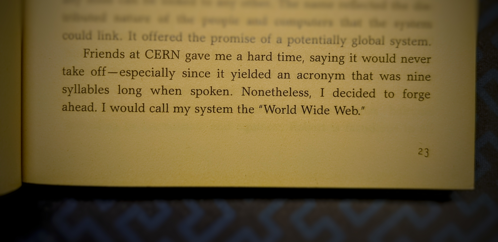

## RECAP

## I SET OUT TO...

## IT WENT...

 - Distributing highly-visual WebAssembly modules using Web Workers and Web Components.

 - Some conventional front-end performance optimizations.

Before diving in too deep, here's the result, the ray tracer from my previous post, running right here in this blog post, at speeds pretty close to native.

<rtw-render></rtw-render>

## The WWWWWW Pattern

The demo above is a WebAssembly module running inside a Web Worker, Wrapped in a Web Component... on a Web Site, in a Web Browser.  Others are using this same pattern, but to my knowledge it doesn't yet have a silly name.  So, I'm dubbing it the **WWWWWW** pattern.  Too many syllables, you say?  I'm just following in the footsteps of the man himself.

<figure>

<figcaption>Tim Berners-Lee, Weaving the Web</figcaption>
</figure>

Silly names aside, Web Components and Web Workers do complement WebAssembly beautifully.  I'd like to write more about WWWWWW, but that'll be a topic for another post.  Back to the ray tracer.

## Performance

   - WWW: Web Workers Work.  trying to make an accurate spinner, but the wasm locks up the main thread, so I'm going to try putting it in a web worker.  module worker, specifically.  module worker worked.
     - except in Firefox, which doesn't support module workers.  the worker runs, but can't import, so I modified it to catch the error and return an error message to the main thread.  the main thread then responds by running the renderer on the main thread.  the timer can't tick up anymore because the  main thread is blocked, so I add a message to indicate what's happening.
   - thank goodnessImageData is a supported type to pass to/from Web Workers: https://developer.mozilla.org/en-US/docs/Web/API/Web_Workers_API/Structured_clone_algorithm

### page perf while rendering, ie WWWWWW

The flow I aimed to optimize here is this.

 1. Fetch & initialize modules
 2. Enable Render button
 3. Begin rendering
 4. Conclude rendering
 5. Display result

Each step must happen ASAP, and there should be no delays between steps.

#### Web Worker

Prevent lockups

Module workers capabilities & browser support.

#### Staircase liquification

Or, flattening the waterfall.  Optimizing this step involved fetching and initializing the modules needed for rendering, both JS and wasm, as quickly as possible with techniques like prefetching and bundling.

For visual reference, here's the download waterfall at 3G speeds, from the point in time when I first got the wasm module into a good, fast state.  In the waterafll, you'll see as perfect a staircase (not a good thing) as I've ever seen.

**Before**

| file | purpose |
| --- | --- |
| `index.html` | loads `wasm-app.js`, the main entrypoint
| `wasm-app.js` | loads `rtw-timer.js`, the component that displays running time
| `wasm-app.js`  |imports the Web Worker, `wasm-worker.js`
| `wasm-worker.js`  |imports `wasm-render.js`, the module responsible for running wasm-pack's output.  `wasm-render.js` can be run either within a Web Worker or without, enabling the ray tracer to run in browsers that don't support module workers, like Firefox.
| `wasm.js`  |is the JS module generated by wasm-bindgen, responsible for instantiating the wasm module and translating types across the wasm/js boundary
| `wasm_bg.wasm`  |is the wasm module for the ray tracer

An interesting discovery here is that the tool I usually reach for to preload assets, `<link rel="preload">`, and `<link rel="modulepreload">`, weren't of any use here, for the following reasons.

Preloaded assets must be used within a "few seconds", so preload isn't the right choice in a case like this where the goal is to prepare all modules necessary for responding instantaneously to a user event.

TODO think about removing this whole section about preloading unless I can come up with a less convoluted way of expressing it.

 - browser performance
   - I wanted to preload the resources, but when using modulepreload, the browser didn't like that some of the modules weren't used in the first few seconds.  additionally, wasm files can't be preloaded with link rel=preload.  my workaround to flatten the waterfall was simply to import() the modules and fetch() the wasm immediately.   importing didn't work well because it would execute the modules too, leading to double execution.  so I wound up fetching everything I needed to preload.
   - have a problem with my measurements here.  my earlier numbers, while evaluating 12-60s wasm slowdown due to rand, were run with quality at 100/66, 4 samples, depth 2, and my later numbers (benchmarks mostly, but also the flamegraphs) were at 300/200, 10 samples, depth 3.  I'll have to re-do something to make the numbers track throughout the blog post.  I think the best I can do is re-do the latest benchmarks at the lower quality.  the flamegraphs don't contain aboslute numbers, and all the measurements in question scale linearly with each other, so they should still be very accurate.

**After**

The file sizes shown here are gzipped, and the network speed was throttled to the "Fast 3G" profile.

#### Slow performance when devtools is open

TODO add warning about 2-3x slower perf when devtools is open.  Link to the section in previous post about it.

## What's next

[wasm-pack]: https://rustwasm.github.io/wasm-pack/book/introduction.html
[generic-correction]: https://www.reddit.com/r/rust/comments/ocaiwb/there_are_many_like_it_but_this_one_is_my_rust/h3wjlf4/?utm_source=reddit&utm_medium=web2x&context=3
[fruitiex]: https://www.reddit.com/user/FruitieX/
[lehmer64]: https://lemire.me/blog/2019/03/19/the-fastest-conventional-random-number-generator-that-can-pass-big-crush/
[lazy_static]: https://crates.io/crates/lazy_static
[rand]: https://crates.io/crates/rand
[rust-lehmer]: https://github.com/mwcz/rust-raytracer-weekend/blob/wasm/lib/src/random.rs
[floatuntidf]: https://github.com/libdfp/libdfp
[wrapping]: https://doc.rust-lang.org/std/num/struct.Wrapping.html
[wasmorg]: https://webassembly.org/
[flamegraph]: https://github.com/flamegraph-rs/flamegraph
[hyperfine]: https://github.com/sharkdp/hyperfine
[prev]: 
[imagedata]: https://developer.mozilla.org/en-US/docs/Web/API/ImageData
