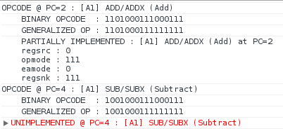

AEJS was an experimental Amiga 500 emulator written in JavaScript. The name
stands for Amiga Emulator JavaScript and is pronounced "aegis".

My motivation to build AEJS came from these sources:

- The HTML5 era introduced new APIs which finally made it possible:
  [Typed arrays][13], [Web Audio][1], [File][2], [Canvas][3], [Fullscreen][4],
  [Gamepad][5]
- Fabrice Bellard's [JavaScript PC emulator][jsemu]
- JavaScript performance was finally good enough to make it feasible
- It bridged front-end web development with low-level machine code, both of
  which are super awesome
- I still have the Amiga 500 I played with obsessively since 3 years-old
- The [68000][6] is legendary and I wanted to find out why

I stopped development for these reasons:

- This was my first emulator, and the Amiga 500 is a fairly complex set of
  chips, and I quickly realized it would take a very long time to complete. I
  decided to focus on other projects which could be finished in a more
  reasonable timeframe (I'm looking at you, [ColorPal][7])
- The final nail in the coffin was realizing that while JavaScript was
  definitely up to the task, there was pretty much no reason to write it
  entirely in JavaScript when it could be written in C and compiled to JS with
  [emscripten][10]. The result would be faster, more robust, and type-safe.

[Scripted Amiga Emulator][8] came out at around the same time I stopped contributing to AEJS. It's based on
[WinUAE][9] and was ported (by hand, I believe) from C++ to JavaScript. A very
impressive project, but not at all what I was going for with AEJS. AEJS was
about fueling my curiosity and exploration and was unlikely to ever be a usable emulator.
works very well, but it didn't demotivate me in any way.

I may come up with the motivation to resume development at some point
in the future. I still love my old Amiga 500 and want to see it live on in
some fashion. I don't like having pet projects nipping at my heels that never
go anywhere, though, so I'm calling this one dead ([for now][11]).

_Addendum_: I just learned today (2013-12-16) that Christian Stefansen ported
PUAE (Portable Universal Amiga Emulator) to PNaCl. This allows UAE to run
inside any Chrome browser. [Check it out][14] or [fork it][15].

[1]: http://www.w3.org/TR/webaudio/ "Web Audio API"
[2]: http://www.w3.org/TR/FileAPI/ "File API"
[3]: http://www.w3.org/TR/2dcontext/ "Canvas 2D context"
[4]: http://www.w3.org/TR/fullscreen/ "Fullscreen API"
[5]: http://www.w3.org/TR/gamepad/ "Gamepad API"
[6]: https://en.wikipedia.org/wiki/Motorola_68000 "Motorola 68000"
[7]: http://colorpal.org/ "ColorPal"
[8]: https://github.com/naTmeg/ScriptedAmigaEmulator "ScriptedAmigaEmulator"
[9]: https://github.com/tonioni/WinUAE "WinUAE"
[10]: http://emscripten.org "emscripten"
[11]: https://github.com/mwcz/AEJS/ "AEJS on GitHub"
[12]: /tag/aejs/ "Posts about AEJS"
[13]: https://developer.mozilla.org/en-US/docs/Web/JavaScript/Typed_arrays "JavaScript typed arrays"
[14]: http://pnacl-amiga-emulator.appspot.com/ "PNaCl port of PUAE"
[15]: https://github.com/cstefansen/PUAE "PNaCl PUAE port's source code"
[jsemu]: http://bellard.org/jslinux/tech.html
