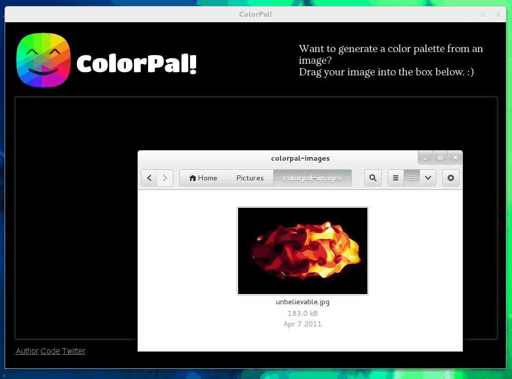

[ColorPal][4] is an HTML5 color palette generator. Here's a gif demonstrating
how to use ColorPal. The color quality in gifs is pretty terrible, but you can
still see the basic usage.

Try it out at [colorpal.org][cpal].

ColorPal also has a [command-line interface][3], powered by [Node.js][2].

I've written some [posts about ColorPal][1].

[1]: /tag/colorpal "Posts about ColorPal"
[2]: http://nodejs.org/ "Node.js official site"
[3]: /2013/11/07/colorpal-cli/ "ColorPal's CLI"
[4]: http://colorpal.org/ "colorpal.org"
[cpal]: http://colorpal.org/
