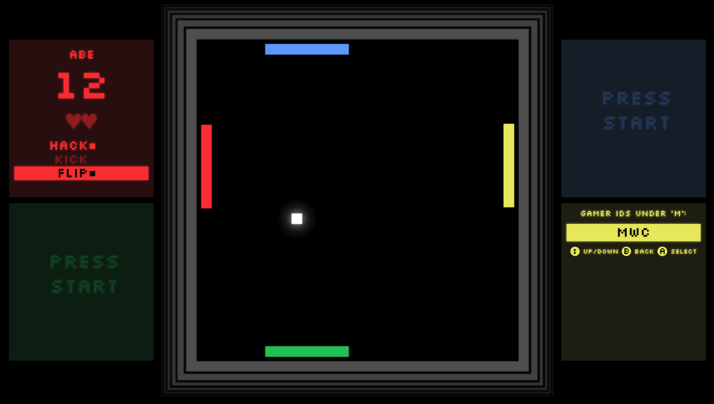
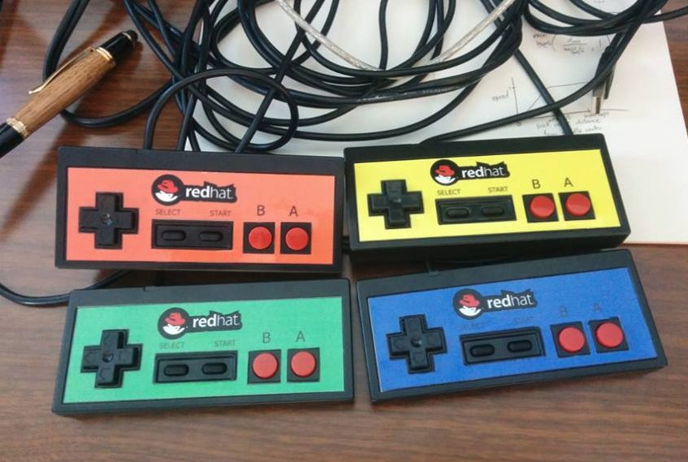
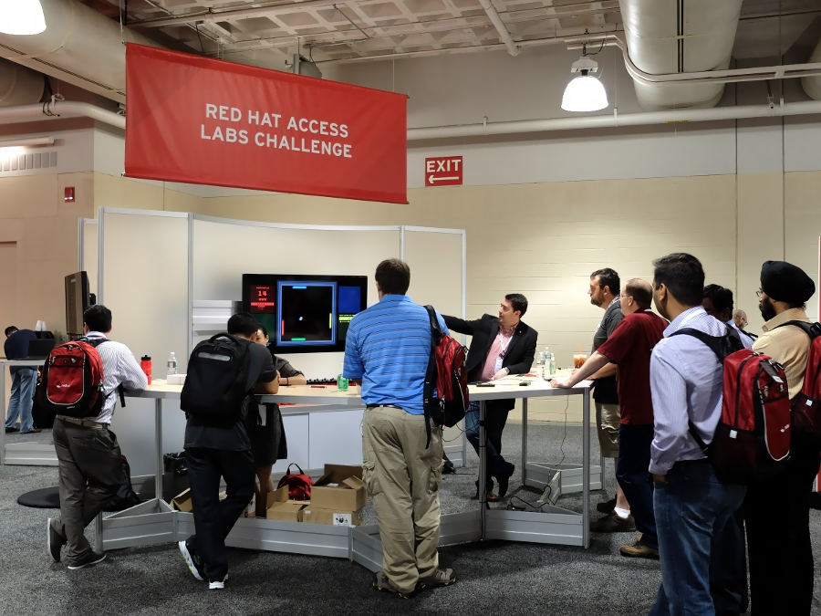

Check out Ping! I created it for my team's booth at [Red Hat Summit
2015][summit] (Red Hat's huge annual conference), to promote [Access
Labs][labs]. It's a 1-4 player pong clone with special powers.

It's Web-based, so you can play it _right this minute_. Our booth had a
quintet of USB gamepads, but your keyboard works just as well. Enjoy stomping
the AI (instead of your fellow humans).

<a class="btn btn-default btn-lg" href="/static/projects/ping">Play now!</a>

Even as a lifelong gamer and programmer, this is the first videogame I've made.
I built it within the excellent [Phaser][phaser] framework. Building it was
incredibly fun and a hurty lesson in the difficulty of game development.
Complexity can really soar out of control when so many subsystems are woven
into a single program.

Fortuitously, I had recently stolen a copy ($35 is a steal!) of what turned out
to be an excellent book: [Game Programming Patterns][gpp] by [Bob
Nystrom][bob]. Several of the patterns described in that book can be found
inside Ping.

Roughly 400 people played the game over the course of the event. The top score
was 597, which earned one dedicated player a pair of sweet headphones. It was
enriching to see so many people enjoying the game. Each player experienced the
game in a unique way, which was both surprising and instructive.

In short, it's fun to make games. It's even better when other people enjoy
them. I think this is the beginning of a beautiful friendship.

&nbsp;

## More information

- [View source][source] - the project's GitHub repo
- [Red Hat Access Labs][labs]
- [Phaser][phaser]

[summit]: http://www.redhat.com/summit/2015/
[source]: https://github.com/redhataccess/pinglabs/
[phaser]: http://phaser.io/
[rhcp]: https://access.redhat.com/
[labs]: https://access.redhat.com/labs/
[gpp]: http://gameprogrammingpatterns.com/
[bob]: https://twitter.com/munificentbob
